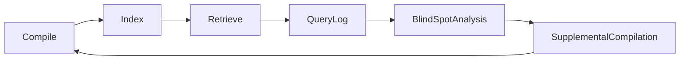

# Wiktor Master Plan (v3.2)

> This document is Wiktor's **overall plan**: it describes the final form of the system, all core capabilities, and design decisions, **not phased by stage**.
> Relationship with `PLAN.md` (v3): both describe the same system. This document answers "what it is, why, and what it looks like"; PLAN.md keeps the phased roadmap and item-by-item acceptance criteria, answering "what to do first, and how well it must pass".
> v3.1 (2026-09-20): the architecture fork has been finalized (final form = database) + the unanimous opinions of the three-member blind review panel have been merged, see the change log at the end and Section 14.
> v3.2 (2026-09-20): the default vector baseline has been changed to the **qdrant external service** (sqlite-vec downgraded to an optional plugin), see 5.6, the change log at the end, and `docs/design/vector-backend-tradeoff.md`.

## 1. Project Positioning

**Wiktor** (wiki + vector, pronounced "Victor"): a knowledge compilation and retrieval middleware whose **final form is a retrieval database oriented toward "knowledge"**.

**In one sentence**: provides API, clustering, and high-availability capabilities like a database; uses an LLM to compile raw data into a structured Wiki at ingestion, and uses hybrid search for semantic recall at query time — **writes are slow (LLM compilation, async), queries are fast (zero LLM)**.

**Benchmark targets (v3.1 revision)**: experience benchmarked against Meilisearch (out-of-the-box, retrieval quality), reliability benchmarked against etcd (treating replication and failure recovery as product properties). No longer a patchwork of three products side by side.

**Core narrative**:
- Generic middleware base + pluggable domain packs: the core layer only knows entities, types, fields, relations; products, documents, and code are all domain packs
- Upgrade knowledge compilation from a one-off LLM call into an **observable, iterable, feedback-enabled engineering system**
- Products (e-commerce milk-tea category, "boba/milk-green-tea" jargon retrieval) are the first official domain pack (Reference Implementation)
- **The kernel does not reinvent wheels** (v3.1): storage, BM25, and the vector baseline reuse the all-in-one SQLite kernel (as rqlite is to SQLite, as Meilisearch is to milli); in-house development focuses on the differentiating components — compilation pipeline, QUG, quality scoring, query orchestration

## 2. Problems and Motivation

Pain points of existing solutions:

- Traditional RAG re-retrieves and re-reasons for every query; knowledge cannot accumulate
- LLM Wiki compilation quality is unstable; there is no quality evaluation or iteration mechanism
- Query rewriting depends on static synonym tables and cannot handle complex intents
- Compilation and retrieval form a one-way pipeline; knowledge blind spots discovered at retrieval time cannot be fed back
- No middleware-level open-source project integrates "compilation + retrieval" into a system that is clusterable, pluggable, and domain-extensible

Wiktor's solution: a complete closed loop of **compile → score → retrieve → feedback → recompile**, where every step is a first-class citizen.

## 3. System Panorama (final form)

```mermaid
flowchart TD
    Client["Client layer: CLI | TUI (optional feature: quality dashboard + query debugging)"]
    API["API layer: tonic (gRPC) | axum (HTTP) | POST /feedback"]
    QE["QueryEngine (orchestration layer; zero LLM on the default path)<br/>QUG graph traversal --(failure→fallback)--> fact filter pushdown [fact plane]<br/>→ hybrid search (FTS5 BM25 + vector) → RRF fusion → optional rerank"]
    Memory["Memory layer: QUG graph | synonym hash | hot cache (invalidated by entity ID)"]
    Storage["Storage layer (all-in-one SQLite; single-transaction atomic publish; litestream backup)<br/>[knowledge plane] Wiki Markdown + quality scores + publish status<br/>[fact plane] structured metadata (written directly by ETL, with source_revision)<br/>[runtime] task queue | query logs | FTS5 inverted index | vector index"]
    Compile["Compilation layer (async workers, horizontally scalable)<br/>YAML parsing → all-dependency content hash → LLM compilation → quality scoring → transactional persistence"]
    Feedback["Feedback layer (async analysis)<br/>query logs + feedback API → blind-spot analysis → supplemental compilation tasks (manual review)"]

    Client -->|gRPC / HTTP (SSE/WS as needed)| API
    API --> QE
    QE --> Memory
    Memory --> Storage
    Storage -->|task driven| Compile
    Compile --> Feedback
```

## 4. Data Model: Two Planes

The entire system rests on the separation of two planes, the highest-priority design decision:

| Plane | Content | Change frequency | Write path |
|------|------|---------|---------|
| **Knowledge plane (Wiki)** | Definitions, synonyms, category hierarchy, ingredient relations, intent templates | Slow | LLM compilation, pure Markdown, human-readable |
| **Fact plane (metadata)** | Filterable fields of numeric/enum/reference types (e.g., price, stock, status) | Fast | Written directly by ordinary ETL, never through the LLM |

- **Iron rule: high-frequency fluctuating fields never enter Wiki pages** — otherwise any field change = one LLM recompilation, and the cost is absurd (the typical example in the e-commerce domain pack is price/stock changes).
- **The Wiki is the source of truth for knowledge; vectors are a derived index**: the knowledge plane can be fully rebuilt from Markdown; the fact plane can be fully rebuilt from source data (JSONL/postgres). Each plane needs its own backup (litestream); the "rebuildable" promise does not cover runtime data.
- **Read consistency is a design trade-off, not a defect**: queries always use "current facts + the most recent published Wiki generation"; the knowledge plane is allowed to lag behind the fact plane; the degree of lag is managed by the quality dashboard and the recompilation queue.
- QUG attribute filtering (turning natural-language constraints into structured conditions) lands on the filterable fields of the fact plane.

## 5. Core Capabilities

### 5.1 Compilation quality observability

Five-dimension scoring, four dimensions computable by rules, one by LLM arbitration:

| Dimension | Implementation | Evaluation method | Threshold trigger |
|------|---------|---------|---------|
| Coverage | **Computable by rules** | Ratio of source-data fields referenced by the Wiki (relies on the Prompt output contract forcing source references) | < 60% recompile |
| Citation integrity | **Computable by rules** | Whether every assertion is backed by a source field; mechanical comparison | No reference → mark for verification |
| Schema compliance | **Computable by rules** | Whether it conforms to the domain pack Schema; serde validation | Non-compliant → reject from store |
| Information density | **Approximate rule** | Effective-information tokens / total tokens | < 40% compress-and-recompile |
| Consistency | **LLM arbitration** | Contradiction detection against existing pages; approximated by embedding recall of top-k related pages + LLM arbitration, **full comparison forbidden** | Contradiction → manual review queue |

**Key mechanism**: The Prompt output contract requires every assertion to carry a source field reference — this single clause turns four of the dimensions from "LLM evaluation" into "mechanical verification".

**Recompilation brake (new in v3.1)**: the recompilation loop must have an upper bound to prevent runaway cost —
- Per-page recompilation cap defaults to 2; exceeding it goes to the manual review queue rather than an infinite loop
- Task-level and global token budgets + circuit breaker; when the budget is exhausted, new tasks queue
- Order-of-magnitude cost estimate for compiling the full milk-tea set (compilation + edge extraction + consistency arbitration, token/fee breakdown)
- Thresholds (0.75 / 60% / 40%) are **calibrated and versioned per domain pack and model version**, not globally hard-coded; continuously validated with golden samples

**Quality dashboard**: shows quality trends by category, by time, and by model; low-quality pages enter the recompilation queue, forming a "compile → score → recompile" loop.

### 5.2 Query Understanding Graph (QUG)

Five types of semantic edges, built at compile time, traversed read-only at query time, millisecond-level. **Edge types are a generic mechanism; specific edges are instantiated by the domain pack** — the examples below come from the e-commerce milk-tea domain pack; other domains (technical documentation, code, etc.) will have their own synonym/hyponym/attribute mappings:

| Edge type | Behavior at query time | E-commerce domain pack example |
|--------|-----------|---------------|
| Synonym edge | Direct substitution | boba ↔ pearl/boba |
| Hyponym edge | Category-expanded recall | milk green tea → milk tea → beverage |
| Attribute propagation edge | Converted to a structured filter (**lands in the fact plane**) | "not sweet" → sugar level ≤ 30% |
| Intent template edge | Expanded into a composite query | "good for drinking in winter" → hot drink + high calorie |
| Negation edge | Generates an exclusion filter | "no pearls" → exclude ingredients containing pearls |

- **Two-track source for intent template edges**: high-frequency templates are hand-written into YAML by the domain pack author (the template is the domain knowledge); LLM extraction only handles long-tail increments. The hand-written scope is targeted by query-log statistics (goal: cover 80% of high-frequency query volume), and the boundary is adjusted by the feedback loop.
- **Explicit fallback**: QUG has no matching path → go straight to hybrid search, and mark `rewrite_failure` in the query log for the feedback layer to analyze. The fallback is a first-class query path, not a logging byproduct.
- **Exit condition (new in v3.1)**: if QUG shows no significant gain on the golden-queries evaluation set (recall improvement < 5%), the QUG module is off by default and stays at hybrid search; it is not a blocking deliverable.

### 5.3 Compilation-retrieval two-way feedback



Three blind-spot signals: zero-recall queries / low-quality recall (low click-and-acceptance rate) / query rewrite failures.

- **Relevance Feedback API** (`POST /feedback`): the middleware has no UI, so acceptance signals must be sent back by the upper-layer application. The API carries authentication, tenant-scope validation, rate limiting, idempotency keys, and payload limits (see the 5.5 reliability contract).
- Feedback tasks enter the **manual review queue** and are not executed automatically, preventing noise pollution.

### 5.4 Full query path (end to end)

```
query → QUG rewrite (Option: None falls back)
      → fact filter pushdown (fact-plane candidate pre-filtering, with an oversampling factor)
      → hybrid search (FTS5 BM25 + vector) → RRF fusion
      → optional rerank (cross_encoder, off by default)
      → results (moka cache, invalidated by entity ID)
```

**Filter pushdown rules (v3.1 revision)**: for any filter generated by QUG or passed in by the user (numeric ranges / enums / reference lists and other filterable fields), the default is to push down through the fact plane for pre-filtering **before recall** (the pre-filtered set is enlarged N-fold before retrieval), then re-rank after fusion — avoiding "top-k first, filter later" dropping legitimate hits before filtering.

**Filtered-empty ≠ blind spot**: when the candidate set is empty after pushdown, retry once with the secondary filters relaxed per the domain pack rules; only then, if still empty, count it as a zero-recall signal — distinguished from "knowledge blind spot" to prevent the feedback layer from misjudging.

**Commitment narrowing (v3.1, revised in v3.2)**: the default query path has **no LLM and no remote model calls**. Embedding computation (local BGE, CPU) gets its own latency budget (target < 15ms); rerank is off by default; **vector search defaults to qdrant** (an externally deployed local vector service; performance targets are measured separately for the qdrant form); external retrieval-engine plugins (Meilisearch adapters, etc.) belong to extended deployment forms and are not mixed into the default path.

### 5.5 Storage kernel and reliability contract (new in v3.1)

**All-in-one SQLite kernel**: the knowledge plane, fact plane, task queue, query log, and FTS5 inverted index all live in a single SQLite database (WAL mode); **the vector index lives in qdrant** (since v3.2; a derived index, rebuildable).

- **Atomic publish = single transaction + two-phase vector sync (v3.2 revision)**: compilation artifacts (page + score + FTS5 rows + fact rows) are committed in one SQLite transaction with the generation updated; embedding vectors are then synced to qdrant (the collection carries generation + content_hash metadata). Vector lag behind page commits is allowed — queries align by generation, and "vector index rebuildable" is the safety net (delete the collection and re-embed from Markdown to recover; no data migration involved); the consistency of the two-phase sync is managed jointly by reliability-contract #1 (all-dependency content hash) and the publish state machine
- **CAS holds naturally**: conditional updates carrying `source_revision`; concurrent ETL / out-of-order retries cannot overwrite newer values with older ones
- **Backup**: continuous replication with litestream; the HA path = standalone → primary-replica (litestream) → future Raft (rqlite has validated the pattern of using the WAL as the Raft log)

**Reliability contract** (lands with the MVP, not a long-term item):

1. **All-dependency content hash**: the content hash covers source data + domain pack version + Prompt template + compiler version + LLM/embedding model version (BLAKE3) — any change triggers recompilation, preventing stale Wikis from being used after a model swap; the hash is persisted together with the page + score + index after a successful commit
2. **Compilation task state machine**: pending / running / succeeded / failed / dead; lease + heartbeat; bounded retries + exponential backoff; dead-letter queue into manual review; idempotency dedup by `(entity_id, source_revision, domain_pack_version)`
3. **Idempotent fact-plane writes**: `upsert_facts` carries a monotonically increasing `source_revision`; late/duplicate events can be safely replayed; source-side deletions propagate as tombstones
4. **Publish state machine**: page candidate → accepted / quarantined; pages that fail citation-integrity validation are in quarantine and **do not enter the query index**
5. **Cache invalidation**: cache keys carry the index generation; fact changes invalidate precisely by entity ID, no whole-page TTL gambling
6. **Prompt injection protection**: source fields are wrapped structurally + field allowlists; sensitive fields never leave the local environment (desensitized or not sent to external models); compilation output passes Schema + source-value-domain validation
7. **Input budgets**: hard caps on data batches, graph-traversal depth, Markdown size, top-k, and feedback payloads; exceeding them goes into the quarantine queue and exposes metrics
8. **Domain pack compatibility**: domain pack/Schema/Prompt adopt semver + artifact version on compilation artifacts; run a full compatibility check before upgrades, full recompilation by the new hash if necessary

### 5.6 Pluggable vector backend

Vector search is isolated behind the `VectorStore` trait and is a **first-class extension point** (one of the three plugin points alongside the data source adapter and the domain pack). The core engine only depends on the trait and is not bound to any specific vector library.

**Why it can be freely swapped**: the vector index is **derived data of the knowledge/fact planes** (Section 4), not the source of truth — deleting the entire vector store allows a rebuild by re-embedding from Markdown + source data. Therefore "switching backends" = swapping a trait implementation + re-embed and rebuild, with no data migration and no impact on the Wiki and the fact plane.

**Backend matrix** (selected by deployment scale, same trait):

| Backend | Form | Applicable scenarios |
|------|------|---------|
| **qdrant** | **External service (default since v3.2)** | **Default path: mature HNSW ANN + first-class payload filtering; 100k vectors × 768d fp32 ≈ 0.32GB on a 2GB small box (quantizable / cold tiering)** |
| In-memory brute-force scan | Built-in | Testing, ultra-small datasets, recall baseline comparison (recall=1.0, no ANN approximation noise, ideal baseline during evaluation) |
| sqlite-vec | Embedded extension (optional plugin) | pre-v1, twice on long hiatus, ANN only alpha — not the default; track its ANN stable release and the official Vec1 |
| hnsw_rs / arroy | In-process ANN library (optional feature) | Standalone with millions of vectors; wants ANN but doesn't want an external service |
| lancedb / Milvus | External service adapter plugin | Distributed, ultra-large scale, existing vector infrastructure |
| pgvector | External service adapter plugin | Already on Postgres and wants a unified storage stack |

**v3.2 decision basis** (research on 2026-09-20, archived at `docs/design/vector-backend-tradeoff.md`): sqlite-vec's latest stable release v0.1.9 is still pure brute-force scan (ANN only in v0.1.10-alpha), with a ~15-month maintenance hiatus from late 2024 to 2026-03 and nearly 4 more months with no maintainer commits since 2026-05; qdrant v1.19 is mature and active. The cost of choosing qdrant (breaking "single-SQLite single-transaction atomic publish", the single-binary promise, and one more external service) is covered by "vectors are a rebuildable derived index + generation alignment".

**Cooperation with filter pushdown** (Section 5.4): backends fall into two categories for handling fact-plane filters —
- **Backends supporting metadata filtering** (qdrant, pgvector, sqlite-vec with metadata): filter conditions are pushed directly to the backend, done in one call
- **Backends without or with weak filtering**: two-stage — first `EntityStore::filter` on the fact plane narrows the candidate ID domain, then the vector backend searches within that ID domain (or amplifies recall and filters locally); the `filters` parameter of `VectorStore::search` is reserved for this cooperation

**Delivery pace (v3.2 revision)**: the kernel first lands the qdrant adapter layer (default vector backend for the MVP) + in-memory brute-force scan (evaluation baseline); sqlite-vec / hnsw_rs / arroy / lancedb / pgvector are split out one by one as separate crates by scale and user demand, without pre-building empty shells (see Section 9). After the first external plugin lands, calibrate the "integration cost < half a day" acceptance target.

## 6. Domain Pack System

The core layer holds no domain assumptions; category hierarchy, attribute key-values, and synonym mappings all sink into the domain pack. A domain pack = the trio of **YAML config + Prompt templates + page templates**, without introducing a custom DSL.

**Filterable field rules (v3.1)**: any field that queries need to filter/exclude must be `filterable: true` and go into the fact plane — even if it is simultaneously a semantic field. In the example, `ingredients` (semantic, goes into compilation) and `ingredient_ids` (filter, goes into the fact plane) appear as a pair precisely for this rule; `ingredient` is a **value node** derived from `ingredient_ids` (not an independent entity), and relation extraction and deletion semantics follow the field.

```yaml
# domains/ecommerce/domain.yaml
name: ecommerce
version: 1.0

entities:
  - name: product
    source: jsonl://examples/milk-tea/products.jsonl   # starts with the JSONL adapter; implement postgres:// through the same interface separately
    id_field: sku_id
    type_field: category_path
    fields:
      - name: price
        type: numeric
        filterable: true      # fact plane
      - name: sugar_level
        type: numeric
        filterable: true      # fact plane："not sweet" → sugar_level ≤ 30
      - name: ingredients
        type: list<alias>
        alias_source: ingredient_aliases   # semantic field → knowledge plane, enters compilation
      - name: ingredient_ids
        type: list<ref>
        filterable: true      # fact plane: the negation edge "no pearls" uses it for exclusion filtering

types:
  - name: category
    parent_field: parent_category
    compile: true
    template: templates/category_page.md
  - name: brand
    compile: true

relations:
  - name: belongs_to
    from: product
    to: category
    extract: source_field
  - name: pairs_with
    from: ingredient          # value node, derived from ingredient_ids
    to: ingredient
    extract: llm

qug:
  intent_templates: templates/intents.yaml   # hand-written high-frequency intent templates
  extract_edges: llm                          # LLM extracts long-tail edges

compile:
  prompt: prompts/product_compile.md
  output_contract: require_source_refs        # assertions must carry source references
  quality_threshold: 0.75
  on_low_quality: recompile
  max_recompiles: 2                           # recompilation brake
  incremental: content_hash                   # all-dependency content hash

query:
  rewrite: qug
  fallback: hybrid_search                     # explicit fallback
  filters: [price, sugar_level, category, ingredient_ids]
  rerank: cross_encoder                       # optional, off by default
```

## 7. Core Abstractions (Rust traits)

```rust
// data source adapter
trait DataSource {
    async fn fetch(&self, cursor: Option<Cursor>) -> Result<Vec<RawEntity>>;
    fn schema(&self) -> EntitySchema;
}

// fact plane storage
trait EntityStore {
    /// source_revision provides idempotency and out-of-order protection: old versions must not overwrite newer versions
    async fn upsert_facts(&self, id: &EntityId, facts: &Facts, source_revision: u64) -> Result<()>;
    async fn filter(&self, filters: &Filters) -> Result<Vec<EntityId>>;
}

// compiler (with quality scoring)
trait Compiler {
    async fn compile(&self, raw: RawEntity, ctx: &CompileContext) -> Result<CompiledPage>;
}

struct CompiledPage {
    wiki: WikiPage,
    quality: QualityScore,
    qug_edges: Vec<QugEdge>,
    content_hash: BLAKE3,   // covers source data + domain-pack version + Prompt + compiler + model versions
}

struct QualityScore {
    coverage: f32,            // rule
    citation: f32,            // rule
    schema_compliance: f32,   // rule
    density: f32,             // rule
    consistency: Option<f32>, // LLM arbitration
}

// query understanding graph
trait QueryUnderstandingGraph {
    /// None means QUG cannot handle it; the caller must fall back to hybrid search
    fn rewrite(&self, query: &Query) -> Option<RewrittenQuery>;
    fn traverse(&self, node: &str, depth: usize) -> Vec<QugPath>;
}

enum QugEdge {
    Synonym { from: String, to: Vec<String> },
    Hyponym { from: String, to: String },
    AttributePropagation { phrase: String, filter: Filter },  // lands on the fact plane
    IntentTemplate { phrase: String, expansion: Query },
    Negation { phrase: String, exclusion: Filter },
}

// domain pack
trait DomainPack {
    fn name(&self) -> &str;
    fn config(&self) -> &DomainConfig;
    fn compiler(&self) -> Box<dyn Compiler>;
    fn qug_builder(&self) -> Box<dyn QugBuilder>;
    fn reranker(&self) -> Option<Box<dyn Reranker>>;
}

// feedback analyzer
trait FeedbackAnalyzer {
    async fn analyze(&self, logs: &[QueryLog]) -> FeedbackReport;
}

struct FeedbackReport {
    zero_recall_queries: Vec<Query>,
    low_quality_hits: Vec<PageId>,
    rewrite_failures: Vec<Query>,
    suggested_compilations: Vec<CompileTask>,  // enters the manual review queue
}

// vector-store adapter (v3.2: default implementation = qdrant; in-memory brute-force scan / sqlite-vec are built-in plugins)
trait VectorStore {
    async fn upsert(&self, collection: &str, ids: &[String], vectors: &[Vec<f32>], metadata: &[Metadata]) -> Result<()>;
    async fn search(&self, collection: &str, query: &[f32], top_k: usize, filters: Option<&Filters>) -> Result<Vec<SearchHit>>;
    async fn delete(&self, collection: &str, ids: &[String]) -> Result<()>;
}
```

**Dependency rule**: plugins depend only on core, not on server. Vector stores and data source adapters are implementers of core traits.

## 8. Product Capability Surface

| Form | Content |
|------|------|
| CLI | `compile` / `search` / `status` / `index`; easter egg `wiktor spider` |
| TUI | Quality dashboard + query debugging — **optional feature**, not in the default build |
| API | gRPC (primary protocol, tonic) + HTTP (axum); `POST /feedback`; SSE/WebSocket added on demand |
| Web UI | Long-term, Tauri + React |
| Distribution | Single binary; cargo features split `cli` / `tui` / `server` / `embed`; the default build does not carry ONNX/TUI (blind-review panel suggestion) |

## 9. Repository Structure

```
wiktor/                          # single-repository Cargo workspace
├── Cargo.toml
├── crates/
│   ├── wiktor-core/             # core engine (traits + QueryEngine + QUG + two planes + SQLite kernel)
│   ├── wiktor-quality/          # quality scorer (four rule dimensions + consistency arbitration)
│   ├── wiktor-feedback/         # feedback analyzer
│   ├── wiktor-server/           # server gRPC + HTTP
│   ├── wiktor-cli/              # CLI (TUI is an optional feature)
│   ├── wiktor-adapter-jsonl/    # data source adapter (postgres adapter implements the same interface separately)
│   ├── wiktor-vector-hnsw/      # pluggable vector backend: in-process ANN (target extension point, split out as needed)
│   ├── wiktor-vector-qdrant/    # pluggable vector backend: external service (target extension point)
│   ├── wiktor-vector-pgvector/  # pluggable vector backend: external service (target extension point)
│   └── wiktor-adapter-meilisearch/ # optional plugin: external retrieval-engine outlet (for scale expansion)
├── domains/
│   └── ecommerce/               # official ecommerce domain pack
│       ├── domain.yaml
│       ├── prompts/
│       └── templates/
├── docs/
│   ├── PLAN.md                  # phased roadmap
│   ├── MASTER-PLAN.md           # this document
│   ├── brand/                   # brand assets
│   ├── domain-pack.md
│   ├── quality-metrics.md
│   └── qug-design.md
└── examples/
    └── milk-tea/
        ├── products.jsonl       # 100-500 products
        ├── golden-queries.jsonl # evaluation set: query → expected hit product list (first-class deliverable)
        └── seed-wiki/           # 20 hand-compiled seed Wiki pages
```

**Crate-splitting pace (v3.1 revision + v3.2)**: only `wiktor-core` + `wiktor-cli` are created at launch; the qdrant vector adapter layer and the in-memory brute-force scan start as modules inside core (feature-gated), and `wiktor-vector-*` plus external retrieval adapters are split into crates as scale and plugin needs demand — avoiding empty-shell crates and dependency hell. The structure above is the target form (including the pluggable vector backend family, see 5.6), not the work-start checklist.

## 10. Technology Stack (v3.1 revision)

| Layer | Choice | Notes |
|------|------|------|
| Language | Rust | Core, server, CLI/TUI |
| Async runtime | tokio | |
| gRPC / HTTP | tonic / axum | |
| **Storage kernel** | **SQLite (rusqlite): WAL + FTS5** | Two planes + queue + log + inverted index, single-transaction atomic publish |
| Backup / HA | litestream primary-replica → future Raft (rqlite pattern: WAL doubles as Raft log) | Dropped redb + a hand-written openraft log storage |
| Vector index | **qdrant (default since v3.2, external service)** / in-memory brute-force scan (evaluation baseline) → sqlite-vec, hnsw_rs, arroy (embedded plugins) → lancedb, pgvector (external plugins) | Trait isolation; ~0.32GB for 100k vectors on qdrant, quantized / cold tiering scales to millions |
| Full-text search | SQLite FTS5 (BM25) | Ultra-large-scale evolution option: tantivy |
| Chinese tokenization | FTS5 custom tokenizer + domain pack vocabulary | Floor guarantee for the jargon scenario; evolve to tantivy + jieba/lindera if insufficient |
| Graph structure | petgraph | QUG |
| Config parsing | serde_yaml_ng | serde_yaml upstream has stopped maintenance |
| Concurrent hash | dashmap | Synonym mappings |
| Cache | moka | Query cache, generation-aware + invalidation by entity ID |
| Content hash | BLAKE3 | Basis for incremental compilation |
| TUI | ratatui + crossterm | Optional feature |
| Web UI | Tauri + React | Long-term |
| LLM calls | async-openai (trait isolation); local models via ollama-compatible endpoints | rig's ecosystem is small, dropped |
| Embedding model | fastembed-rs | Local BGE; page summary + section-level dual index |
| Serialization | serde + prost | |
| Observability | tracing + prometheus | |

## 11. Acceptance Baseline

**Quality**: quality scoring vs. human evaluation correlation > 0.7. **Prerequisite deliverable (v3.1)**: a human quality-annotation set for 50-100 Wiki pages, otherwise this metric cannot be validated.

**Retrieval** (using the e-commerce milk-tea domain pack as the evaluation vehicle to validate general retrieval capability; the golden-queries evaluation set ≥ 100 entries, covering the four categories of jargon/intent/negation/filter):
- Recall: pure vector < hybrid < QUG-enhanced, quantifiable at each level; **if QUG shows no significant gain (< 5%) it is off by default, not an acceptance iron rule**
- QUG fallback performs the same as hybrid search, no penalty (retain this commitment after separately validating quality and P99 on the same dataset)

**Performance targets** (default query path: SQLite + locally deployed qdrant, thousand-page scale; plugin/external-engine forms tested separately):

| Query type | Target P99 | Path |
|---------|---------|------|
| Cache hit | < 5ms | moka |
| Pure structured filter | < 10ms | Fact-plane SQLite index |
| Pure vector search | < 20ms | qdrant (locally deployed) |
| Hybrid search + RRF | < 50ms | FTS5 + vector + fusion |
| With QUG rewrite | < 60ms | graph traversal + hybrid search |
| Query embedding computation | < 15ms | Local BGE CPU, separate budget |
| Write path | minute-level | async tasks |

**Operations**: the knowledge plane can be fully rebuilt from Markdown, the fact plane can be fully rebuilt from source data; full index rebuild < 30s (thousand-page scale); pages that failed review (quarantine) never appear in query results; new external plugin integration cost target < half a day (to be calibrated by measurement after the first plugin).

## 12. Key Design Decisions

1. **Two-plane data model**: knowledge goes into the Wiki (LLM-compiled), facts go into metadata (written directly by ETL). filterable/numeric fields never enter the Wiki; read consistency = current facts + most recent Wiki generation.
2. **The default query path has zero LLM and zero remote models**; QUG has an explicit fallback; filter pushdown runs before recall.
3. **Quality scoring: four rule dimensions + one LLM dimension**, the Prompt output contract (require_source_refs) is the prerequisite for the four rule dimensions; recompilation has a brake (cap + budget + manual queue).
4. **QUG is built at compile time and read-only at query time**, intent templates are hand-written (target: cover 80% of high-frequency queries) + LLM long-tail, a dual track; has an exit condition.
5. **Incremental compilation relies on the all-dependency content hash (BLAKE3)**; index publish = one SQLite transaction (page/score/FTS5/facts) + two-phase vector sync to qdrant (generation alignment + rebuildable safety net).
6. **The feedback loop is async + manual review**, the relevance feedback API carries authentication and rate limiting.
7. **Domain packs are YAML + Prompt + templates, no DSL**; filter fields must be `filterable` and enter the fact plane.
8. **Plugins depend only on core**; the three plugin points = data source adapter / domain pack / vector backend (VectorStore trait). The vector backend defaults to qdrant (v3.2), in-memory brute-force scan is the evaluation baseline, sqlite-vec/hnsw/arroy/lancedb/pgvector are optional plugins (see 5.6); external retrieval engines (Meilisearch) are an optional scale outlet, none of them is the product identity.
9. **The storage kernel reuses SQLite** (WAL/FTS5/litestream), no self-built storage or index engines; vector search reuses qdrant (external service); in-house development concentrates on the compilation, understanding, and orchestration layers.
10. **Single-binary distribution** (feature split), single-repo Cargo workspace; build core + cli first, split the rest on demand.

## 13. Risks and Mitigations

| Risk | Mitigation |
|------|------|
| Large gap between quality scoring and human evaluation | Manual annotation set delivered up front, scoring model replaceable, thresholds calibrated per domain |
| High QUG graph construction cost | Incremental construction + all-dependency content hash |
| Runaway recompilation cost | Brake trio: per-page cap, token-budget circuit breaker, manual queue |
| Filtered-empty retrieval misjudged as a blind spot | Pushdown + relaxed retry + separation of filtered-empty/blind-spot signals |
| Insufficient YAML expressiveness | Hand-written seed Wiki validates early; limited extension if necessary |
| Feedback-loop noise | Manual review queue, no automatic execution; API authentication and rate limiting |
| Scale ceiling (Wiki volume explosion) | Category tiering: deep compilation for core, lightweight indexing for long tail (tiering criteria: query frequency × product value, calibrated with the feedback loop) |
| SQLite single-writer bottleneck | WAL + batched merge writes; beyond scale, go through the memory layer/external engine plugins |
| Chinese tokenization quality (jargon floor) | FTS5 custom tokenizer + domain pack vocabulary; if insufficient, tantivy + jieba/lindera or an external engine |
| Weak Rust LLM ecosystem | Trait isolation, async-openai + ollama-compatible endpoints |
| Engineering complexity out of control | Minimum complete form first (Section 16); satellite components all feature-gated |
| Hard open-source cold start | Make the milk-tea domain pack "textbook-grade"; the benchmark narrative focuses on "LLM knowledge compilation engineering" |

## 14. Settled and Pending Items (v3.1)

**Settled** (2026-09-20, unanimous among the three-member blind review panel + user decision):

1. **Architecture**: final form = full-stack middleware (retrieval database) — user decision. Delivery path is "minimal kernel first": SQLite handles storage/BM25, vector search defaults to qdrant (v3.2), in-house development concentrates on the compilation pipeline, QUG, quality scoring, and query orchestration; external engines such as Meilisearch remain optional plugins and scale outlets, not the product identity.
2. **Storage stack**: all-in-one SQLite (WAL / FTS5 / litestream) + default vector service qdrant (v3.2), dropping the default route of redb + a hand-written openraft log storage (rqlite has validated the pattern of using the WAL as the Raft log; the long-term Raft path follows this route).
3. **Full-text index**: FTS5; tantivy is the ultra-large-scale evolution option. No self-built in-memory inverted index.
4. **Config parsing**: serde_yaml → serde_yaml_ng.
5. **Domain name**: not blocking development; stake crates.io `wiktor` + the GitHub org first.

**Pending**:

- Confirm availability of wiktor.dev / wiktor.io before registering
- Trade-off of GitHub org name (wiktor-rs) vs. crate name (wiktor) mismatch
- Competitor comparison table (Vectara / Pinecone / Weaviate / LangChain / WeKnora, etc.; dimensions: compilation observability / pluginability / open source vs. hosted) — complete before writing the README

## 15. Brand

- **Mascot**: spider. Action-level fit: web-building = compilation, vibration sensing = zero-LLM retrieval, re-weavable web = rebuildable vector index. Forced mappings were dropped (8 legs = protocols, 8 eyes = quality dimensions).
- **Primary logo**: **pure geometric web + centered W** (no spider drawn) — avoids Tarantool (database) and Scrapy (crawler framework) two prior occupancies, while also preventing "spider + search" from being misread as a crawler tool.
- **Spider as secondary character**: documentation illustrations, release notes, TUI easter egg `wiktor spider`; the `#` on its abdomen echoes Markdown.
- **Palette**: deep navy `#101A2E` / warm orange `#E8833A` (silk) / off-white `#F5F0E8` (nodes and W) / beige `#FAF7F2` (light background).
- **Assets**: `docs/brand/` (ascii-logo.md, gen_logo.py, wiktor-web[-dark|-light].svg, wiktor-spider-dark.svg).
- **Naming**: crates.io `wiktor` ✅ available; GitHub `wiktor` occupied by a 2008 legacy account; suggested crate name `wiktor` + org name `wiktor-rs`.

## 16. Minimum Complete Form (MVP definition)

A single process, single binary, single SQLite database + one locally deployed qdrant vector service is enough to run through all core value (v3.2 revision):

- Two-plane schema + compilation pipeline (Prompt contract + four-rule scoring + brake + all-dependency hash)
- QUG five edge types + explicit fallback + filter-pushdown query path
- JSONL data source + 20 hand-written seed Wiki pages + golden-queries evaluation
- CLI (`compile` / `search` / `status` / `vector ping`)

**Not in the MVP**: TUI, Web UI, SSE/WS, Raft/primary-replica, external retrieval engines (Meilisearch, etc.), and the remaining vector backend plugins (sqlite-vec / hnsw_rs / arroy / lancedb / pgvector), LLM consistency arbitration (can be added later), Prometheus (tracing first).

## 17. Delivery Dependencies (non-phased roadmap)

The order below expresses only **dependencies** (what must run before what), not time phasing; item-by-item acceptance criteria are in `PLAN.md`:

1. `wiktor-core` trait definitions + two-plane SQLite schema + qdrant vector adapter layer
2. 20 hand-written seed Wiki pages + JSONL fact plane + SQLite kernel (FTS5) + qdrant vector baseline
3. Minimum query closed loop: index → QUG/fallback → filter pushdown → CLI display ✅ (delivered in Step 3, 2026-09-21; petgraph QUG graph, QueryEngine orchestration, RRF fusion, `--json`/`--no-vector` CLI; the QUG exit condition is executable — golden three-tier A pure-FTS 85% / B hybrid 100% / C QUG 100%, B is +15pp over A, and QUG adds no further gain over B → disabled by default per the exit condition)
4. LLM compilation pipeline + require_source_refs contract + four-rule quality scoring + recompilation brake + all-dependency content hash ✅ (Step 4 delivered 2026-09-22; includes the 0003 migration with accepted-only FTS indexing, BLAKE3 all-dependency hashing with incremental skip, the source-ref-v1 citation contract and four-rule scoring, page/task brakes with lease fencing, token-budget circuit breaking, the `wiktor compile` CLI (mock/openai/ollama, dry-run and exit-code contract), and stale-vector-payload validation; offline acceptance needs no key and no network, real-provider smoke is separately marked; implementation deviations in `docs/design/step4-compile-pipeline.md` §13)
5. QUG five edge types + golden-queries evaluation (pure vector vs. hybrid vs. QUG, including the exit-condition determination) ✅ (Step 5 delivered 2026-09-23; includes the 0004 migration (qug_builds generation parent + independent qug_page_snapshots/qug_intent_edges persistence), BLAKE3 source_hash with hash-hit reuse, single-transaction atomic publish (rollback keeps the old graph readable), startup-load hash verification with explicit stale/disabled fallback, golden expanded to 134 entries (34 legacy + 100 new; quotas synonym 25/intent 20/negation 20/attribute_filter 20/negative 15), A/B/C three-tier evaluation (recall@1/5/10 + negative_precision + per-kind breakdown, bilingual + JSON reports), and the `wiktor qug build`/`wiktor eval` CLI (exit codes 0/1/2/3/4); exit-condition determination: the milk-tea fixture offline evaluation (`--no-qdrant` mock vector backend) shows a C-over-B recall@10 gain of +40.17pp ≥ 5pp → `qug_decision=enabled`; re-test once a real vector backend is attached; implementation deviations in `docs/design/step5-qug-build.md` §9)
6. Feedback analyzer + `POST /feedback` (authentication / rate limiting / idempotency) ✅ (Step 6 delivered 2026-09-23; includes the 0005 migration (feedback_events/review_queue/feedback_rejections plus domain and filter-empty/relax-retry columns with partial indexes on query_logs), the `wiktor-feedback` crate (FeedbackStore trait + standard analyzer: deterministic aggregation of the three blind-spot signals — zero recall / low-quality recall / rewrite failure — canonical subject_json with BLAKE3 report_hash, atomic bilingual Markdown + JSON report writes) and the new `wiktor-server` crate (axum 0.7: `POST /feedback` + `GET /health` + `GET /metrics`, Bearer API-key domain authorization never persisted, fixed-window rate limiting 60s/120, per-event idempotency key in the body (`(domain,idempotency_key)` unique with idempotent replay on duplicates), 64KiB/100-entry input budget returning 413 into an isolated rejection table), QueryEngine empty-candidate relax-and-retry exactly once (FilterRelaxer) with log_query returning the log id, admission queue approve invoking admit_compile inside the same BEGIN IMMEDIATE (query-template approval writes audit only), the `wiktor feedback analyze|list|review` CLI (exit codes 0/1/2/3/4), and WAL + busy_timeout=5000 consolidation with a concurrent-writer smoke test; offline acceptance: 289 tests green + clean clippy/fmt; implementation deviations in `docs/design/step6-feedback-loop.en.md` §12)
7. `wiktor-server` (gRPC + HTTP)
8. Consistency arbitration dimension + complete task state machine (lease / dead-letter / compatibility check)
9. HA: litestream primary-replica → future Raft (rqlite pattern) ✅ (Step 9 delivered 2026-09-24; single host + remote/local replica continuous WAL replication with a pinned litestream 0.5.17, deployed on Linux Debian 13; `deploy/` provides install / preflight / isolated recovery-drill scripts; zero Rust changes (D10); the real recovery drill `PASS`ed on a Linux disposable DB — integrity / foreign key / row counts / marker all verified (A1/A2/A7/A8/A9 measured), SFTP-to-Mac and systemd residency are production bring-up items; implementation deviations in `docs/design/step9-backup-ha.en.md` §7 (STEP9-011..015: asset name has no `v` and uses x86_64, v0.5.17 removed `generations` in favor of status/ltx, `sync-interval` is db-level, offline reuse and portable sha256))
10. Cluster sharding + plugin ecosystem (Meilisearch outlet, external vector stores) + second official domain pack (technical documentation) ✅ (Step 10 delivered 2026-09-24; **implemented**: ①second official domain pack `examples/tech-docs/` (20 knowledge pages + 120 facts + 134 golden, proving the domain-pack plugin point extends beyond e-commerce) + the domain-pack contribution guide `docs/domain-pack-guide(.en).md`; ②golden filter generalization (`GoldenFilters` changed from milk-tea-hardcoded price/sugar/size/ingredients to a domain-generic condition list `{"conditions":[...]}`, `golden_filters_to_filters` passes field names through; milk-tea's 134 golden records mechanically migrated keeping the 134/quota/legacy assertions; the tech-docs eval smoke is green); ③the qdrant vector backend split into the `wiktor-vector-qdrant` plugin crate (depends only on core; `cargo tree` confirms no server/feedback; core dropped the vector-qdrant feature and the qdrant-client dependency; MockVectorStore stays as the eval baseline; the CLI assembles the plugin); ④the Meilisearch outlet plugin `wiktor-adapter-meilisearch` + the `wiktor export meilisearch` subcommand (feature export-meilisearch; PATCHes accepted pages to `${WIKTOR_MEILISEARCH_URL}`; mock-HTTP verified 2/2; quarantine is never exported); **cluster sharding = design plan** (`docs/design/step10-cluster-sharding(.en).md`: domain first-level shard key + routing + whole-domain rebalance + single-writer/same-domain atomic-publish boundary, seam with the deferred rqlite-Raft path; explicitly no crate/implementation); workspace 393+ tests all green; implementation deviations in `docs/design/step10-plugin-ecosystem.md` §5 (STEP10-001..003: GoldenFilters uses `{"conditions":[...]}` not a bare array, core error.rs adds `Error::External` breaking server/feedback exhaustive matches, core's default feature changes from `["vector-qdrant"]` to empty so the CLI assembles the plugin))

11. Performance & evidence closeout (criterion benchmarks + feedback-loop iteration proof + QUG-vs-static cross-domain retest) + Web console (local form, pulled in from the "long-term Web UI") ✅ (Step 11 delivered 2026-09-25; ①`criterion` three-tier benchmarks: per-query P99 ≤ 2ms, all within target (pure-FTS<20ms / hybrid<50ms / with-QUG<60ms, `docs/design/step11-benchmarks(.en).md` §7); ②feedback-loop iteration proof: zero-recall blind spot → analyzer detects it → supplementary compile → recall@1 0→1 (the `feedback_loop_iteration.rs` integration test); ③QUG-vs-static cross-domain retest: gain_pp(B→C) < 5pp on both milk-tea/tech-docs → disabled, while the static baseline A sits clearly below C (`qug_vs_static.rs`); ④the `wiktor domain list` CLI and `GET /metrics` additions; ⑤the Web console as the new `wiktor-console` crate (feature `console`, off by default, `wiktor console --db --listen`): reads `SqliteKernel` in-process + serves the `docs/console_ui/code.html` prototype visuals at `/` + `/api/overview|tasks|reviews|qug|search|domains` (search goes through the same QueryEngine as the CLI and returns QueryDiagnostics), end-to-end curl-verified PASS; the TUI (ratatui) is deferred (crates.io unreachable); implementation deviations in `docs/design/step11-console(.en).md` §7 (STEP11-001..005))

12. TUI (clearing the Step 11 debt) + console frontend on real data + production deployment orchestration ✅ (Step 12 delivered 2026-09-25; ①`wiktor tui` (feature `tui`, ratatui 0.29 + crossterm 0.28): four tabs (dashboard/tasks/reviews/query) sharing the Web console's data plane (in-process kernel reads + the QueryEngine hybrid fallback), pure state functions + TestBackend tests, keyboard navigation (1-4/Tab/Enter/q); ②the console frontend on real data: `/api/overview` gains due-task status counts, `code.html` carries `data-live` markers + a vanilla-fetch rendering layer (15s poll, offline-badge fallback, the search box hitting `POST /api/search` to render hits and the fts/vector/rrf_k breakdown), browser-verified with a real seeded DB PASS; ③production deployment orchestration in `deploy/`: `wiktor-server`/`wiktor-console` systemd units (sandbox aligned with litestream, loopback listeners) + `wiktor.env.example` (WIKTOR_API_KEYS) + `install-wiktor.sh` (release build on the server, idempotent) + `smoke-deploy.sh` + a bring-up runbook, accepted on a real Linux Debian 13 box; precondition: the rsproxy mirror unlocked crates.io (root cause of STEP11-001/005 resolved); deviations in `docs/design/step12-tui-console-prod(.en).md` §7 (STEP12-001..004))

## Change Log

**v3.1 (2026-09-20) relative to v3**:
1. **Architecture fork finalized**: final form = full-stack middleware (database), user decision; delivery goes "minimal kernel first", external engines downgraded to optional plugins.
2. **Storage kernel switched to all-in-one SQLite** (WAL / FTS5 / sqlite-vec / litestream), dropping redb + a hand-written openraft log storage; "atomic swap" is naturally provided by the single transaction.
3. **New 5.5 reliability contract**: all-dependency content hash (BLAKE3), compilation task state machine (lease/idempotency/dead-letter), fact-plane source_revision CAS, publish state machine (quarantine not indexed), cache invalidation by entity ID, prompt injection protection, input budgets, domain pack semver compatibility.
4. **Query-path revision**: filter pushdown moved to before recall (the original "post-RRF filtering" missed recall); filtered-empty and knowledge-blind-spot signals separated; "zero LLM/zero async" narrowed to "no LLM, no remote models on the default path", embedding latency gets its own budget.
5. **Recompilation brake**: per-page cap (default 2), token-budget circuit breaker, order-of-magnitude cost estimate deliverable; thresholds calibrated per domain.
6. **Example domain.yaml revision**: added the two fact-plane fields sugar_level / ingredient_ids, established the "filter fields must be filterable" rule, ingredient explicitly a value node.
7. **Evaluation deliverables completed**: golden-queries ≥ 100 entries + 50-100 pages of manually annotated set; QUG given an exit condition (off by default when gain < 5%).
8. **Narrative and structure**: benchmark changed to "experience benchmarked against Meilisearch, reliability against etcd"; added the minimum complete form (MVP) definition; TUI feature-gated; crate family changed to a target form, only core + cli built at launch; async-openai replaces rig; serde_yaml_ng; the "rebuildable" promise revised so each plane (knowledge/fact) rebuilds on its own.
9. All changes come from the unanimous or majority consensus of the three-member blind review panel (α gatekeeper / β pragmatist / γ explorer), and the user can veto each item.

**v3.1 patch (2026-09-20, user feedback)**:
10. **De-commoditization of the main text**: Wiktor is a general retrieval service; products (e-commerce milk-tea) are only an example domain pack. The wording of the two-plane table, iron rule, QUG attribute filtering, filter pushdown, and acceptance baseline is changed to general terms; the QUG five-edge-type table gets the framing "edge types are generic, examples are from the e-commerce domain pack", with the example column relabeled "e-commerce domain pack example"; the retrieval acceptance is restated as "using the e-commerce milk-tea domain pack as the evaluation vehicle to validate general retrieval capability".
11. **Pluggable vector backend restored** (new Section 5.6): the positioning of the VectorStore trait as one of the three plugin points, the backend selection matrix (sqlite-vec built-in baseline / brute-force scan / hnsw_rs·arroy / qdrant·lancedb·Milvus / pgvector), the two cooperation modes with fact-plane filter pushdown, and the principle that rebuildable = swappable backend; the repository structure restores `wiktor-vector-*` as target extension points, and decision #8 spells out the three plugin points.

**v3.2 (2026-09-20, user decision)**:
12. **Default vector baseline changed to the qdrant external service**: dropped v3.1's default sqlite-vec (research confirmed it is pre-v1, on hiatus twice (late 2024-2026-03, 2026-05 to now), its stable release is still pure brute-force scan, and ANN is only in v0.1.10-alpha). qdrant handles only the vector leg of recall; knowledge/facts/FTS5 remain in SQLite; SQLite has no vector table.
13. **Atomic-publish contract revised**: "single transaction" narrowed to "one SQLite transaction (page/score/FTS5/facts) + two-phase vector sync to qdrant", with generation alignment + rebuildable derived index as the safety net; read-consistency semantics unchanged.
14. **MVP definition revised**: the vector service (local qdrant) becomes an MVP dependency; `vector ping` joins the CLI; sqlite-vec and other embedded/external backends downgraded to optional plugins, not in the MVP.
15. Synchronized revisions: 5.4 commitment narrowing, 5.5 kernel wording, 5.6 backend matrix and delivery pace, Section 7 VectorStore comments, Section 9 crate-splitting pace, Section 10 technology stack, Section 11 acceptance baseline (pure vector search path changed to qdrant), decisions #5/#8/#9 in Section 12, settled items #1/#2 in Section 14, delivery dependencies #1/#2 in Section 17. The full research is in `docs/design/vector-backend-tradeoff.md`.

**v3 (2026-09-19) relative to v2**:
1. Added the **two-plane data model** (principle #1, architecture diagram, EntityStore trait) — knowledge goes into the Wiki, facts go into metadata, and the vector index covers both planes.
2. **Quality scoring split**: four rule dimensions (relying on the require_source_refs contract) + an LLM consistency dimension (top-k arbitration, full comparison forbidden).
3. **QUG explicit fallback** (`rewrite` returns Option) + intent-template hand-written/extraction dual track + golden-queries evaluation set promoted to a first-class deliverable.
4. **Technology stack revision**: removed sled, use redb; Phase 1 drops HNSW/tantivy, data source starts with JSONL.
5. **Phase 1 reorder**: hand-compile 20 pages to validate the data model before connecting the LLM; TUI deferred; content-hash incrementality, atomic swap, and the relevance feedback API restored.
6. **Brand finalized**: web primary logo + spider mascot, palette and ASCII finalized.