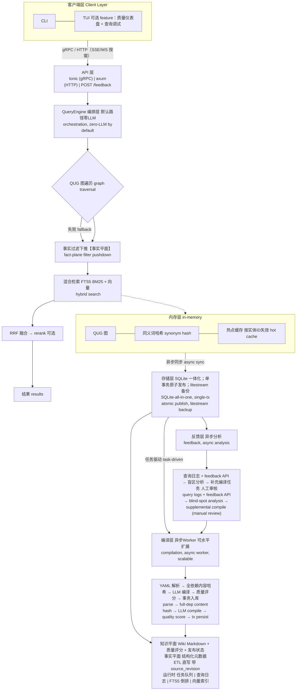
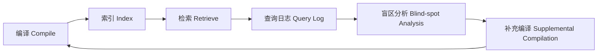

# Wiktor 总规划（Master Plan v3.2）

> 本文是 Wiktor 的**整体规划**：描述系统的最终形态、全部核心能力与设计决策，**不按阶段分期**。
> 与 `PLAN.md`（v3）的关系：两者描述同一个系统。本文回答"是什么、为什么、长什么样"；PLAN.md 保留阶段化路线图与逐项验收标准，回答"先做什么、做到什么程度算过"。
> v3.1（2026-09-20）：架构分叉拍板（最终形态 = 数据库）+ 盲审团三席一致意见合入，见文末变更记录与第十四节。
> v3.2（2026-09-20）：默认向量基线改为 **qdrant 外部服务**（sqlite-vec 降为可选插件），见 5.6、文末变更记录与 `docs/design/vector-backend-tradeoff.md`。

## 一、项目定位

**Wiktor**（wiki + vector，读作"维克托"）：知识编译与检索中间件，**最终形态是一个面向"知识"的检索数据库**。

**一句话**：像数据库一样提供 API、集群和高可用能力；用 LLM 在摄入时把原始数据编译为结构化 Wiki，用混合检索在查询时做语义召回——**写入慢（LLM 编译，异步），查询快（零 LLM）**。

**对标（v3.1 修正）**：体验对标 Meilisearch（开箱即用、检索质量），可靠性对标 etcd（把复制与故障恢复当产品属性）。不再拼凑三产品并列。

**核心叙事**：
- 通用中间件底座 + 可插拔领域包：核心层只认识实体、类型、字段、关系；商品、文档、代码都是领域包
- 把知识编译从一次性 LLM 调用，升级为**可观测、可迭代、可反馈的工程系统**
- 商品（电商奶茶品类，"啵啵/奶绿"黑话检索）是第一个官方领域包（Reference Implementation）
- **内核不重复造轮子**（v3.1）：存储、BM25、向量基线复用 SQLite 一体化内核（如同 rqlite 之于 SQLite、Meilisearch 之于 milli）；自研集中在差异化组件——编译管线、QUG、质量评分、查询编排

## 二、问题与动机

现有方案的痛点：

- 传统 RAG 每次查询都要重新检索和推理，知识无法积累
- LLM Wiki 编译质量不稳定，没有质量评估和迭代机制
- 查询改写依赖静态同义词表，无法处理复杂意图
- 编译和检索是单向管道，检索时发现的知识盲区无法反馈
- 没有中间件级的开源项目把"编译 + 检索"整合成可集群、可插件、可领域扩展的系统

Wiktor 的解法：**编译 → 评分 → 检索 → 反馈 → 再编译**的完整闭环，每一步都是一等公民。

## 三、系统全景（最终形态）



## 四、数据模型：两平面

整个系统建立在两平面分离之上，这是最高优先级的设计决策：

| 平面 | 内容 | 变化频率 | 写入方式 |
|------|------|---------|---------|
| **知识平面（Wiki）** | 定义、同义词、品类层级、配料关系、意图模板 | 慢 | LLM 编译，纯 Markdown，人类可读 |
| **事实平面（元数据）** | 数值/枚举/引用等 filterable 字段（如价格、库存、状态） | 快 | 普通 ETL 直写，完全不走 LLM |

- **铁律：高频变动字段永不进 Wiki 页面**——否则字段一改 = 一次 LLM 重编译，成本荒谬（电商领域包里典型例子是改价/改库存）。
- **Wiki 是知识的事实来源，向量是派生索引**：知识平面可从 Markdown 完整重建；事实平面可从源数据（JSONL/postgres）完整重建。两个平面各自需要备份（litestream），"可重建"承诺不覆盖运行时数据。
- **读一致性是设计取舍而非缺陷**：查询永远使用"当前事实 + 最近一代已发布 Wiki"，知识平面允许滞后于事实平面；滞后程度由质量仪表盘与重编译队列管理。
- QUG 的属性过滤（把自然语言约束转成结构化条件）落在事实平面的 filterable 字段上。

## 五、核心能力

### 5.1 编译质量可观测

五维评分，四维规则可算、一维 LLM 仲裁：

| 维度 | 实现方式 | 评估方式 | 阈值触发 |
|------|---------|---------|---------|
| 覆盖度 | **规则可算** | 源数据字段被 Wiki 引用的比例（依赖 Prompt 输出契约强制带 source 引用） | < 60% 重编译 |
| 引用完整性 | **规则可算** | 每个断言是否有 source 字段支撑，机械比对 | 无引用 → 标记待验证 |
| 结构合规 | **规则可算** | 是否符合领域包 Schema，serde 校验 | 不合规 → 拒绝入库 |
| 信息密度 | **近似规则** | 有效信息 token / 总 token | < 40% 压缩重编译 |
| 一致性 | **LLM 仲裁** | 与已有页面矛盾检测；嵌入召回 top-k 相关页 + LLM 仲裁近似，**禁止全量比对** | 矛盾 → 人工审核队列 |

**关键机制**：Prompt 输出契约要求每个断言携带 source 字段引用——这一条让四个维度从"LLM 评估"变成"机械校验"。

**重编译刹车（v3.1 新增）**：重编译循环必须有上限，防止成本失控——
- 每页重编译上限默认 2 次，超限进人工审核队列而非死循环
- 任务级与全局 token 预算 + 熔断；预算耗尽新任务排队
- 交付奶茶全集的编译成本量级估算（编译 + 抽边 + 一致性仲裁，token/费用清单）
- 阈值（0.75 / 60% / 40%）按领域包与模型版本**校准并版本化**，不是全局硬编码；用 golden 样本持续验证

**质量仪表盘**：按品类、按时间、按模型展示质量趋势；低质量页面进重编译队列，形成"编译 → 评分 → 重编译"循环。

### 5.2 查询理解图（QUG）

五类语义边，编译时构建、查询时只读遍历、毫秒级。**边类型是通用机制，具体边由领域包实例化**——下表示例取自电商奶茶领域包，其它领域（技术文档、代码等）会有各自的同义/上下位/属性映射：

| 边类型 | 查询时行为 | 电商领域包示例 |
|--------|-----------|---------------|
| 同义边 | 直接替换 | 啵啵 ↔ 珍珠/波霸 |
| 上下位边 | 品类扩展召回 | 奶绿 → 奶茶 → 饮品 |
| 属性传播边 | 转为结构化过滤（**落事实平面**） | "不甜的" → 糖度 ≤ 30% |
| 意图模板边 | 展开为复合查询 | "适合冬天喝的" → 热饮 + 高热量 |
| 否定边 | 生成排除过滤器 | "不要珍珠" → 排除配料含珍珠 |

- **意图模板边来源双轨制**：高频模板由领域包作者手写进 YAML（模板即领域知识），LLM 抽取只做长尾增量。手写范围以查询日志统计为目标（目标：覆盖 80% 高频查询量），边界随反馈闭环调整。
- **显式 fallback**：QUG 无匹配路径 → 直接走混合检索，并在查询日志标记 `rewrite_failure` 供反馈层分析。fallback 是一等查询路径，不是日志副产品。
- **退出条件（v3.1 新增）**：若 QUG 在 golden-queries 评测集上无显著增益（召回提升 < 5%），QUG 模块默认关闭、停在混合检索，不作为阻塞交付。

### 5.3 编译-检索双向反馈



三个盲区信号：零召回查询 / 低质量召回（点击·采纳率低）/ 查询改写失败。

- **Relevance Feedback API**（`POST /feedback`）：中间件没有 UI，采纳信号必须由上层应用回传。API 带认证、租户范围校验、限流、幂等键与载荷上限（见 5.5 可靠性契约）。
- 反馈任务进**人工审核队列**，不自动执行，防止噪音污染。

### 5.4 查询全链路（端到端）

```
query → QUG rewrite（Option：None 则 fallback）
      → 事实过滤下推（事实平面预筛候选，带过采样系数）
      → 混合检索（FTS5 BM25 + 向量）→ RRF 融合
      → 可选 rerank（cross_encoder，默认关闭）
      → 结果（moka 缓存，按实体 ID 失效）
```

**过滤下推规则（v3.1 修正）**：凡 QUG 生成或用户传入的过滤（数值区间 / 枚举 / 引用列表等 filterable 字段），默认在**召回前**经事实平面下推预筛（预筛集放大 N 倍再检索），融合后精排——避免"先 top-k 再过滤"把合法命中的实体在过滤前丢掉。

**滤空 ≠ 盲区**：下推后候选为空时，先按领域包规则放宽次级过滤重试一次，仍为空才计入零召回信号——与"知识盲区"区分，防止反馈层误判。

**承诺收窄（v3.1，v3.2 修订）**：默认查询路径**无 LLM、无远程模型调用**。嵌入计算（本地 BGE，CPU）单列延迟预算（目标 < 15ms）；rerank 默认关闭；**向量检索默认走 qdrant**（本地部署的外部向量服务，性能目标按 qdrant 形态单独测定）；外部检索引擎插件（Meilisearch 适配器等）属于扩展部署形态，不与默认路径混用。

### 5.5 存储内核与可靠性契约（v3.1 新增）

**SQLite 一体化内核**：知识平面、事实平面、任务队列、查询日志、FTS5 倒排全部在同一个 SQLite 库（WAL 模式）；**向量索引在 qdrant**（v3.2 起，派生索引可重建）。

- **原子发布 = 单事务 + 向量两段同步（v3.2 修订）**：编译产物（页面 + 评分 + FTS5 行 + 事实行）在一个 SQLite 事务内提交并更新 generation；随后把嵌入向量同步到 qdrant（collection 携带 generation + content_hash 元数据）。向量滞后于页面提交是允许的——查询按 generation 对齐，"向量索引可重建"兜底（删 collection 从 Markdown 重嵌入即恢复，不涉及数据迁移）；两段同步的一致性由可靠性契约 #1（全依赖内容哈希）+ 发布状态机共同管理
- **CAS 天然成立**：带 `source_revision` 的条件更新，并发 ETL / 乱序重试不会旧值覆盖新值
- **备份**：litestream 持续复制；HA 路线 = 单机 → 主从（litestream）→ 远期 Raft（rqlite 已验证 WAL 兼作 Raft log 的模式）

**可靠性契约**（随 MVP 落地，不是远期项）：

1. **全依赖内容哈希**：content hash 覆盖源数据 + 领域包版本 + Prompt 模板 + 编译器版本 + LLM/嵌入模型版本（BLAKE3）——任一变更即触发重编译，防止换模型后仍用旧 Wiki；哈希在页面+评分+索引提交成功后一并落库
2. **编译任务状态机**：pending / running / succeeded / failed / dead；租约 + 心跳；有限重试 + 指数退避；死信队列进人工审核；按 `(entity_id, source_revision, domain_pack_version)` 幂等去重
3. **事实平面幂等写入**：`upsert_facts` 携带单调 `source_revision`，迟到/重复事件可安全重放；源端删除以 tombstone 传播
4. **发布状态机**：页面 candidate → accepted / quarantined；未通过引用完整性校验的页面处于 quarantine，**不入查询索引**
5. **缓存失效**：缓存键带索引 generation；事实变更按实体 ID 精准失效，不做整页 TTL 赌博
6. **Prompt 注入防护**：源字段结构化包裹 + 字段允许列表；敏感字段不出本地（脱敏或不送外部模型）；编译输出过 Schema + source 值域校验
7. **输入预算**：数据批次、图遍历深度、Markdown 体积、top-k、反馈载荷均设硬上限，超限进隔离队列并暴露指标
8. **领域包兼容**：领域包/Schema/Prompt 引入 semver + 编译产物 artifact version；升级前跑全量兼容检查，必要时按新哈希全量重编译

### 5.6 可插拔向量后端

向量检索经 `VectorStore` trait 隔离，是**一等扩展点**（与数据源适配器、领域包并列的三大插件点之一）。核心引擎只依赖 trait，不绑定任何具体向量库。

**为什么能自由插拔**：向量索引是**知识/事实平面的派生数据**（第四节），不是事实来源——删掉整个向量库后可从 Markdown + 源数据重新嵌入重建。因此"换后端"= 换一个 trait 实现 + 重嵌入重建，不涉及数据迁移，也不影响 Wiki 与事实平面。

**后端矩阵**（按部署规模选型，同一 trait）：

| 后端 | 形态 | 适用场景 |
|------|------|---------|
| **qdrant** | **外部服务（v3.2 起为默认）** | **默认路径：成熟 HNSW ANN + 一等公民 payload 过滤；2GB 小机十万级 × 768d fp32 ≈ 0.32GB（可量化 / 冷分层）** |
| 内存暴力扫描 | 内置 | 测试、超小数据集、召回基线对照（recall=1.0，无 ANN 近似噪声，评测期理想基线） |
| sqlite-vec | 嵌入式扩展（可选插件） | pre-v1、两次长期停更、ANN 仅 alpha——不作为默认；跟踪其 ANN 稳定版与官方 Vec1 |
| hnsw_rs / arroy | 进程内 ANN 库（可选 feature） | 单机百万级，要 ANN 但不想引外部服务 |
| lancedb / Milvus | 外部服务适配插件 | 分布式、超大规模、已有向量基础设施 |
| pgvector | 外部服务适配插件 | 已用 Postgres、想统一存储栈 |

**v3.2 决策依据**（2026-09-20 调研，存档 `docs/design/vector-backend-tradeoff.md`）：sqlite-vec 最新稳定版 v0.1.9 仍纯暴力扫描（ANN 只在 v0.1.10-alpha），2024 底~2026-03 停更约 15 个月、2026-05 起又近 4 个月无维护者提交；qdrant v1.19 成熟活跃。选 qdrant 的代价（击穿"单 SQLite 单事务原子发布"、单二进制承诺、多一个外部服务）由"向量是派生索引可重建 + generation 对齐"兜底。

**与过滤下推的协作**（第 5.4 节）：后端分两类处理事实平面过滤——
- **支持元数据过滤的后端**（qdrant、pgvector、sqlite-vec 带 metadata）：过滤条件直接下推给后端，一次调用完成
- **不支持或过滤能力弱的后端**：走两阶段——先由事实平面 `EntityStore::filter` 筛出候选 ID 域，再让向量后端在该 ID 域内检索（或放大召回后本地过滤）；`VectorStore::search` 的 `filters` 参数即为此协作预留

**落地节奏（v3.2 修订）**：内核先落 qdrant 适配层（MVP 默认向量后端）+ 内存暴力扫描（评测基线）；sqlite-vec / hnsw_rs / arroy / lancedb / pgvector 按规模与用户需求逐个作为独立 crate 拆出，不预建空壳（见第九节）。首个外部插件落地后校准"接入成本 < 半天"的验收目标。

## 六、领域包体系

核心层不持有任何领域假设；品类层级、属性键值、同义词映射全部下沉到领域包。领域包 = **YAML 配置 + Prompt 模板 + 页面模板**三件套，不引入自定义 DSL。

**过滤字段规则（v3.1）**：凡是查询需要过滤/排除的字段，必须 `filterable: true` 进事实平面——即使它同时是语义字段。示例中 `ingredients`（语义，进编译）与 `ingredient_ids`（过滤，进事实平面）成对出现即为此规则；`ingredient` 是由 `ingredient_ids` 派生的**值节点**（不是独立实体），关系抽取与删除语义随字段走。

```yaml
# domains/ecommerce/domain.yaml
name: ecommerce
version: 1.0

entities:
  - name: product
    source: jsonl://examples/milk-tea/products.jsonl   # JSONL 适配器起步，postgres:// 同接口另实现
    id_field: sku_id
    type_field: category_path
    fields:
      - name: price
        type: numeric
        filterable: true      # 事实平面
      - name: sugar_level
        type: numeric
        filterable: true      # 事实平面："不甜的" → sugar_level ≤ 30
      - name: ingredients
        type: list<alias>
        alias_source: ingredient_aliases   # 语义字段 → 知识平面，进编译
      - name: ingredient_ids
        type: list<ref>
        filterable: true      # 事实平面：否定边"不要珍珠"用它做排除过滤

types:
  - name: category
    parent_field: parent_category
    compile: true
    template: templates/category_page.md
  - name: brand
    compile: true

relations:
  - name: belongs_to
    from: product
    to: category
    extract: source_field
  - name: pairs_with
    from: ingredient          # 值节点，派生自 ingredient_ids
    to: ingredient
    extract: llm

qug:
  intent_templates: templates/intents.yaml   # 手写高频意图模板
  extract_edges: llm                          # LLM 抽取长尾边

compile:
  prompt: prompts/product_compile.md
  output_contract: require_source_refs        # 强制断言带 source 引用
  quality_threshold: 0.75
  on_low_quality: recompile
  max_recompiles: 2                           # 重编译刹车
  incremental: content_hash                   # 全依赖内容哈希

query:
  rewrite: qug
  fallback: hybrid_search                     # 显式 fallback
  filters: [price, sugar_level, category, ingredient_ids]
  rerank: cross_encoder                       # 可选，默认关闭
```

## 七、核心抽象（Rust trait）

```rust
// 数据源适配器
trait DataSource {
    async fn fetch(&self, cursor: Option<Cursor>) -> Result<Vec<RawEntity>>;
    fn schema(&self) -> EntitySchema;
}

// 事实平面存储
trait EntityStore {
    /// source_revision 用于幂等与乱序防护：旧版本不得覆盖新版本
    async fn upsert_facts(&self, id: &EntityId, facts: &Facts, source_revision: u64) -> Result<()>;
    async fn filter(&self, filters: &Filters) -> Result<Vec<EntityId>>;
}

// 编译器（带质量评分）
trait Compiler {
    async fn compile(&self, raw: RawEntity, ctx: &CompileContext) -> Result<CompiledPage>;
}

struct CompiledPage {
    wiki: WikiPage,
    quality: QualityScore,
    qug_edges: Vec<QugEdge>,
    content_hash: BLAKE3,   // 覆盖源数据+领域包版本+Prompt+编译器+模型版本
}

struct QualityScore {
    coverage: f32,            // 规则
    citation: f32,            // 规则
    schema_compliance: f32,   // 规则
    density: f32,             // 规则
    consistency: Option<f32>, // LLM 仲裁
}

// 查询理解图
trait QueryUnderstandingGraph {
    /// 返回 None = QUG 无法处理，调用方必须 fallback 到混合检索
    fn rewrite(&self, query: &Query) -> Option<RewrittenQuery>;
    fn traverse(&self, node: &str, depth: usize) -> Vec<QugPath>;
}

enum QugEdge {
    Synonym { from: String, to: Vec<String> },
    Hyponym { from: String, to: String },
    AttributePropagation { phrase: String, filter: Filter },  // 落事实平面
    IntentTemplate { phrase: String, expansion: Query },
    Negation { phrase: String, exclusion: Filter },
}

// 领域包
trait DomainPack {
    fn name(&self) -> &str;
    fn config(&self) -> &DomainConfig;
    fn compiler(&self) -> Box<dyn Compiler>;
    fn qug_builder(&self) -> Box<dyn QugBuilder>;
    fn reranker(&self) -> Option<Box<dyn Reranker>>;
}

// 反馈分析器
trait FeedbackAnalyzer {
    async fn analyze(&self, logs: &[QueryLog]) -> FeedbackReport;
}

struct FeedbackReport {
    zero_recall_queries: Vec<Query>,
    low_quality_hits: Vec<PageId>,
    rewrite_failures: Vec<Query>,
    suggested_compilations: Vec<CompileTask>,  // 进人工审核队列
}

// 向量库适配器（v3.2：默认实现 = qdrant；内存暴力扫描 / sqlite-vec 为内置插件）
trait VectorStore {
    async fn upsert(&self, collection: &str, ids: &[String], vectors: &[Vec<f32>], metadata: &[Metadata]) -> Result<()>;
    async fn search(&self, collection: &str, query: &[f32], top_k: usize, filters: Option<&Filters>) -> Result<Vec<SearchHit>>;
    async fn delete(&self, collection: &str, ids: &[String]) -> Result<()>;
}
```

**依赖规则**：插件只依赖 core，不依赖 server。向量库、数据源适配器都是 core trait 的实现者。

## 八、产品能力面

| 形态 | 内容 |
|------|------|
| CLI | `compile` / `search` / `status` / `index`；彩蛋 `wiktor spider` |
| TUI | 质量仪表盘 + 查询调试——**可选 feature**，不进默认构建 |
| API | gRPC（主协议，tonic）+ HTTP（axum）；`POST /feedback`；SSE/WebSocket 按需再加 |
| Web UI | 远期，Tauri + React |
| 分发 | 单二进制，cargo feature 拆分 `cli` / `tui` / `server` / `embed`，默认构建不携带 ONNX/TUI（盲审团建议） |

## 九、仓库结构

```
wiktor/                          # Cargo workspace 单仓
├── Cargo.toml
├── crates/
│   ├── wiktor-core/             # 核心引擎（trait + QueryEngine + QUG + 两平面 + SQLite 内核）
│   ├── wiktor-quality/          # 质量评分器（四规则维度 + 一致性仲裁）
│   ├── wiktor-feedback/         # 反馈分析器
│   ├── wiktor-server/           # 服务端 gRPC + HTTP
│   ├── wiktor-cli/              # CLI（TUI 为可选 feature）
│   ├── wiktor-adapter-jsonl/    # 数据源适配器（postgres 适配器同接口另实现）
│   ├── wiktor-vector-hnsw/      # 可插拔向量后端：进程内 ANN（目标扩展点，按需拆出）
│   ├── wiktor-vector-qdrant/    # 可插拔向量后端：外部服务（目标扩展点）
│   ├── wiktor-vector-pgvector/  # 可插拔向量后端：外部服务（目标扩展点）
│   └── wiktor-adapter-meilisearch/ # 可选插件：外部检索引擎出口（规模扩展用）
├── domains/
│   └── ecommerce/               # 官方商品领域包
│       ├── domain.yaml
│       ├── prompts/
│       └── templates/
├── docs/
│   ├── PLAN.md                  # 阶段化路线图
│   ├── MASTER-PLAN.md           # 本文档
│   ├── brand/                   # 品牌资产
│   ├── domain-pack.md
│   ├── quality-metrics.md
│   └── qug-design.md
└── examples/
    └── milk-tea/
        ├── products.jsonl       # 100-500 个商品
        ├── golden-queries.jsonl # 评测集：查询 → 期望命中商品列表（一等交付物）
        └── seed-wiki/           # 手工编译的 20 个种子 Wiki 页面
```

**拆 crate 节奏（v3.1 修订 + v3.2）**：落地只建 `wiktor-core` + `wiktor-cli`；qdrant 向量适配层与内存暴力扫描先作 core 内模块（feature-gated），`wiktor-vector-*` 与外部检索适配器随规模与插件需求再拆 crate——避免空壳 crate 和依赖地狱。上方结构是目标形态（含可插拔向量后端族，见 5.6），不是开工清单。

## 十、技术栈（v3.1 修订）

| 层级 | 选型 | 说明 |
|------|------|------|
| 语言 | Rust | 核心、服务端、CLI/TUI |
| 异步运行时 | tokio | |
| gRPC / HTTP | tonic / axum | |
| **存储内核** | **SQLite（rusqlite）：WAL + FTS5** | 两平面 + 队列 + 日志 + 倒排，单事务原子发布 |
| 备份 / HA | litestream 主从 → 远期 Raft（rqlite 模式：WAL 兼作 Raft log） | 放弃 redb + 自写 openraft log storage |
| 向量索引 | **qdrant（v3.2 默认，外部服务）** / 内存暴力扫描（评测基线）→ sqlite-vec、hnsw_rs、arroy（嵌入式插件）→ lancedb、pgvector（外部插件） | trait 隔离；十万级 qdrant ≈ 0.32GB，量化 / 冷分层可上百万级 |
| 全文检索 | SQLite FTS5（BM25） | 超大规模演进选项：tantivy |
| 中文分词 | FTS5 自定义 tokenizer + 领域包词表 | 黑话场景的下限保障，不足则演进 tantivy + jieba/lindera |
| 图结构 | petgraph | QUG |
| 配置解析 | serde_yaml_ng | serde_yaml 上游已停止维护 |
| 并发哈希 | dashmap | 同义词映射 |
| 缓存 | moka | 查询缓存，generation-aware + 按实体 ID 失效 |
| 内容哈希 | BLAKE3 | 增量编译依据 |
| TUI | ratatui + crossterm | 可选 feature |
| Web UI | Tauri + React | 远期 |
| LLM 调用 | async-openai（trait 隔离）；本地模型走 ollama 兼容端点 | rig 生态较小，弃用 |
| 嵌入模型 | fastembed-rs | 本地 BGE；页面摘要 + 章节级双索引 |
| 序列化 | serde + prost | |
| 可观测性 | tracing + prometheus | |

## 十一、验收基线

**质量**：质量评分与人工评估相关性 > 0.7。**前置交付物（v3.1）**：50-100 页 Wiki 的人工质量标注集，否则该指标无法验证。

**检索**（以电商奶茶领域包为评测载体，验证通用检索能力；golden-queries 评测集 ≥ 100 条，覆盖黑话/意图/否定/过滤四类）：
- 召回率：纯向量 < 混合 < QUG 增强，逐级可量化；**QUG 无显著增益（< 5%）则默认关闭，不作为验收铁律**
- QUG fallback 与混合检索同性能，无惩罚（同一数据集上分别验证质量与 P99 后保留该承诺）

**性能目标**（默认查询路径：SQLite + 本地部署 qdrant，千级页面规模；插件/外部引擎形态另测）：

| 查询类型 | 目标 P99 | 路径 |
|---------|---------|------|
| 缓存命中 | < 5ms | moka |
| 纯结构化过滤 | < 10ms | 事实平面 SQLite 索引 |
| 纯向量检索 | < 20ms | qdrant（本地部署） |
| 混合检索 + RRF | < 50ms | FTS5 + 向量 + 融合 |
| 含 QUG 改写 | < 60ms | 图遍历 + 混合检索 |
| 查询嵌入计算 | < 15ms | 本地 BGE CPU，单列预算 |
| 写入路径 | 分钟级 | 异步任务 |

**运维**：知识平面可从 Markdown 全量重建、事实平面可从源数据全量重建；全量索引重建 < 30s（千级页面）；未过审页面（quarantine）不出现于查询结果；新外部插件接入成本目标 < 半天（待首个插件实测校准）。

## 十二、关键设计决策

1. **两平面数据模型**：知识进 Wiki（LLM 编译），事实进元数据（ETL 直写）。filterable/numeric 字段永不进 Wiki；读一致性 = 当前事实 + 最近一代 Wiki。
2. **默认查询路径零 LLM、零远程模型**；QUG 显式 fallback；过滤下推在召回前执行。
3. **质量评分四规则维度 + 一 LLM 维度**，Prompt 输出契约（require_source_refs）是四规则维度的前提；重编译有刹车（上限 + 预算 + 人工队列）。
4. **QUG 编译时构建、查询时只读**，意图模板手写（目标覆盖 80% 高频查询）+ LLM 长尾双轨；有退出条件。
5. **增量编译靠全依赖内容哈希（BLAKE3）**；索引发布 = SQLite 单事务（页面/评分/FTS5/事实）+ 向量两段同步到 qdrant（generation 对齐 + 可重建兜底）。
6. **反馈闭环异步 + 人工审核**，relevance feedback API 带认证与限流。
7. **领域包 YAML + Prompt + 模板，无 DSL**；过滤字段必须 filterable 进事实平面。
8. **插件只依赖 core**；三大插件点 = 数据源适配器 / 领域包 / 向量后端（VectorStore trait）。向量后端默认 qdrant（v3.2），内存暴力扫描为评测基线，sqlite-vec/hnsw/arroy/lancedb/pgvector 为可选插件（见 5.6）；外部检索引擎（Meilisearch）是可选规模出口，均不是产品身份。
9. **存储内核复用 SQLite**（WAL/FTS5/litestream），不自研存储与索引引擎；向量检索复用 qdrant（外部服务）；自研集中在编译、理解与编排层。
10. **单二进制分发**（feature 拆分），单仓 Cargo workspace；先建 core + cli，其余随需拆分。

## 十三、风险与应对

| 风险 | 应对 |
|------|------|
| 质量评分与人工评估偏差大 | 人工标注集前置交付，评分模型可替换，阈值按领域校准 |
| QUG 图构建成本高 | 增量构建 + 全依赖内容哈希 |
| 重编译成本失控 | 刹车三件套：页级上限、token 预算熔断、人工队列 |
| 检索滤空被误判为盲区 | 下推 + 放宽重试 + 滤空/盲区信号分离 |
| YAML 表达力不足 | 手工种子 Wiki 提前验证，必要时有限扩展 |
| 反馈闭环噪音 | 人工审核队列，不自动执行；API 认证限流 |
| 规模上限（Wiki 体积爆炸） | 品类分级：核心深度编译，长尾轻量索引（分级判据：查询频率 × 商品价值，随反馈闭环定标） |
| SQLite 单写瓶颈 | WAL + 批量合并写入；超规模走内存层/外部引擎插件 |
| 中文分词质量（黑话下限） | FTS5 自定义 tokenizer + 领域包词表；不足则 tantivy + jieba/lindera 或外部引擎 |
| Rust LLM 生态薄弱 | trait 隔离，async-openai + ollama 兼容端点 |
| 工程复杂度失控 | 最小完整形态先行（第十六节），卫星件一律 feature 化 |
| 开源冷启动难 | 奶茶领域包做成"教科书级"；对标叙事聚焦"LLM 知识编译工程化" |

## 十四、已决事项与遗留事项（v3.1）

**已决**（2026-09-20，盲审团三席一致 + 用户拍板）：

1. **架构**：最终形态 = 全栈中间件（检索数据库）——用户拍板。落地"最小内核先行"：SQLite 承担存储/BM25，向量检索默认 qdrant（v3.2），自研集中在编译管线、QUG、质量评分、查询编排；Meilisearch 等外部引擎保留为可选插件与规模出口，不是产品身份。
2. **存储栈**：SQLite 一体化（WAL / FTS5 / litestream）+ 默认向量服务 qdrant（v3.2），放弃 redb + 自写 openraft log storage 的默认路线（rqlite 已验证 WAL 兼作 Raft log 的模式，远期 Raft 沿此路走）。
3. **全文索引**：FTS5；tantivy 为超大规模演进选项。不自研内存倒排。
4. **配置解析**：serde_yaml → serde_yaml_ng。
5. **域名**：不阻塞开发；先占 crates.io `wiktor` + GitHub org。

**遗留**：

- wiktor.dev / wiktor.io 可用性注册前确认
- GitHub org 名（wiktor-rs）与 crate 名（wiktor）不一致的取舍
- 竞品对比表（Vectara / Pinecone / Weaviate / LangChain / WeKnora 等，维度：编译可观测性 / 插件化 / 开源 vs 托管）——写入 README 前完成

## 十五、品牌

- **吉祥物**：蜘蛛。动作级契合：结网=编译、振动感知=零 LLM 检索、网可重织=向量索引可重建。舍弃强行映射（8 腿=协议、8 眼=质量维度）。
- **主 logo**：**纯几何蛛网 + 中心 W**（不画蜘蛛）——规避 Tarantool（数据库）与 Scrapy（爬虫框架）两个在先占用，同时避免"蜘蛛+搜索"被误读为爬虫工具。
- **蜘蛛为次级角色**：文档插画、release note、TUI 彩蛋 `wiktor spider`；腹部带 `#` 呼应 Markdown。
- **色板**：深藏青 `#101A2E` / 暖橙 `#E8833A`（蛛丝）/ 米白 `#F5F0E8`（节点与 W）/ 米色 `#FAF7F2`（浅底）。
- **资产**：`docs/brand/`（ascii-logo.md、gen_logo.py、wiktor-web[-dark|-light].svg、wiktor-spider-dark.svg）。
- **命名**：crates.io `wiktor` ✅ 可用；GitHub `wiktor` 被 2008 年老账号占用，建议 crate 名 `wiktor` + org 名 `wiktor-rs`。

## 十六、最小完整形态（MVP 定义）

单进程、单二进制、单 SQLite 库 + 一个本地部署的 qdrant 向量服务，即可跑通全部核心价值（v3.2 修订）：

- 两平面 schema + 编译管线（Prompt 契约 + 四规则评分 + 刹车 + 全依赖哈希）
- QUG 五类边 + 显式 fallback + 过滤下推的查询链路
- JSONL 数据源 + 20 个手工种子 Wiki + golden-queries 评测
- CLI（compile / search / status / vector ping）

**不进 MVP**：TUI、Web UI、SSE/WS、Raft/主从、外部检索引擎（Meilisearch 等）与其余向量后端插件（sqlite-vec / hnsw_rs / arroy / lancedb / pgvector）、一致性 LLM 仲裁（可后补）、Prometheus（先 tracing）。

## 十七、落地依赖（非分期路线图）

以下顺序只表达**依赖关系**（谁先谁后才能跑通），不是时间分期；逐项验收标准见 `PLAN.md`：

1. `wiktor-core` trait 定义 + 两平面 SQLite schema + qdrant 向量适配层
2. 20 个手工种子 Wiki + JSONL 事实平面 + SQLite 内核（FTS5）+ qdrant 向量基线
3. 最小查询闭环：索引 → QUG/fallback → 过滤下推 → CLI 展示 ✅（Step 3 已交付，2026-09-21；含 petgraph QUG 图、QueryEngine 编排、RRF 融合、`--json`/`--no-vector` CLI；QUG 退出条件可执行——golden 三档 A 纯FTS 85% / B 混合 100% / C QUG 100%，B 相对 A +15pp，QUG 相对 B 无额外增益 → 按退出条件默认关闭）
4. LLM 编译管线 + require_source_refs 契约 + 四规则质量评分 + 重编译刹车 + 全依赖内容哈希 ✅（Step 4 已交付，2026-09-22；含 0003 迁移与仅 accepted 入索引的 FTS、BLAKE3 全依赖哈希与增量跳过、source-ref-v1 引用契约与四规则评分、页级/任务级刹车与租约 fencing、token 预算熔断、`wiktor compile` CLI（mock/openai/ollama，dry-run 与退出码契约）、向量 payload 过期校验；离线验收无 key 无网络，真实 provider smoke 独立标注；实现偏差见 `docs/design/step4-compile-pipeline.md` §13）
5. QUG 五类边构建 + golden-queries 评测（纯向量 vs 混合 vs QUG，含退出条件判定）✅（Step 5 已交付，2026-09-23；含 0004 迁移（qug_builds 代次父表 + qug_page_snapshots/qug_intent_edges 独立持久化）、BLAKE3 source_hash 与 hash 命中复用、单事务原子发布（失败回滚旧图可读）、启动加载 hash 校验与 stale/disabled 显式 fallback、golden 扩容至 134 条（legacy 34 + 新增 100，配额 synonym 25/intent 20/negation 20/attribute_filter 20/negative 15）、A/B/C 三档评测（recall@1/5/10 + negative_precision + 按 kind 分层，双语 + JSON 报告）、`wiktor qug build`/`wiktor eval` CLI（退出码 0/1/2/3/4）；退出条件判定：milk-tea fixture 离线评测（`--no-qdrant` mock 向量后端）C 相对 B 的 recall@10 增益 +40.17pp ≥ 5pp → `qug_decision=enabled`，真实向量后端接入后需复测；实现偏差见 `docs/design/step5-qug-build.md` §9）
6. 反馈分析器 + `POST /feedback`（认证 / 限流 / 幂等）
7. `wiktor-server`（gRPC + HTTP）
8. 一致性仲裁维度 + 任务状态机补全（租约 / 死信 / 兼容检查）
9. HA：litestream 主从 → 远期 Raft（rqlite 模式）
10. 集群分片 + 插件生态（Meilisearch 出口、外部向量库）+ 第二官方领域包（技术文档）

## 变更记录

**v3.1（2026-09-20）相对 v3**：
1. **架构分叉拍板**：最终形态 = 全栈中间件（数据库），用户拍板；落地走"最小内核先行"，外部引擎降为可选插件。
2. **存储内核换 SQLite 一体化**（WAL / FTS5 / sqlite-vec / litestream），放弃 redb + 自写 openraft log storage；"原子 swap"由单事务天然提供。
3. **新增 5.5 可靠性契约**：全依赖内容哈希（BLAKE3）、编译任务状态机（租约/幂等/死信）、事实平面 source_revision CAS、发布状态机（quarantine 不入索引）、缓存按实体 ID 失效、Prompt 注入防护、输入预算、领域包 semver 兼容。
4. **查询链路修正**：过滤下推到召回前（原"RRF 后过滤"会漏召回）；滤空与知识盲区信号分离；"零 LLM/零 async"收窄为"默认路径无 LLM、无远程模型"，嵌入延迟单列预算。
5. **重编译刹车**：页级上限（默认 2 次）、token 预算熔断、成本量级估算交付物；阈值按领域校准。
6. **示例 domain.yaml 修正**：补 sugar_level / ingredient_ids 两个事实平面字段，确立"过滤字段必须 filterable"规则，ingredient 明确为值节点。
7. **评测交付物补全**：golden-queries ≥ 100 条 + 50-100 页人工标注集；QUG 增设退出条件（增益 < 5% 默认关闭）。
8. **叙事与结构**：对标改为"体验对标 Meilisearch、可靠性对标 etcd"；新增最小完整形态（MVP）定义；TUI/feature 化；crate 家族改为目标形态、开工只建 core + cli；async-openai 替代 rig；serde_yaml_ng；"可重建"承诺修正为知识/事实平面各自重建。
9. 全部修改来自盲审团三席（α 守门员 / β 务实派 / γ 探索派）一致或两席以上共识，用户逐项可否决。

**v3.1 补丁（2026-09-20，用户反馈）**：
10. **正文去商品化**：Wiktor 是通用检索服务，商品（电商奶茶）仅作领域包举例。两平面表、铁律、QUG 属性过滤、过滤下推、验收基线的措辞改为通用表述；QUG 五类边表加"边类型通用、示例取自电商领域包"框定，示例列改标"电商领域包示例"；检索验收改述为"以电商奶茶领域包为评测载体，验证通用检索能力"。
11. **补回可插拔向量后端**（新增 5.6 节）：VectorStore trait 作为三大插件点之一的定位、后端选型矩阵（sqlite-vec 内置基线 / 暴力扫描 / hnsw_rs·arroy / qdrant·lancedb·Milvus / pgvector）、与事实平面过滤下推的两种协作方式、可重建即可换后端的原理；仓库结构补回 `wiktor-vector-*` 为目标扩展点，决策 #8 明确三大插件点。

**v3.2（2026-09-20，用户拍板）**：
12. **默认向量基线改为 qdrant 外部服务**：弃 v3.1 默认的 sqlite-vec（调研确认其 pre-v1、两次长期停更（2024 底~2026-03、2026-05 至今）、稳定版仍纯暴力扫描、ANN 仅 v0.1.10-alpha）。qdrant 只承担向量一路召回；知识/事实/FTS5 仍在 SQLite；SQLite 无向量表。
13. **原子发布契约修订**："单事务"收窄为"SQLite 单事务（页面/评分/FTS5/事实）+ 向量两段同步到 qdrant"，generation 对齐 + 派生索引可重建兜底；读一致性语义不变。
14. **MVP 定义修订**：向量服务（本地 qdrant）成为 MVP 依赖；`vector ping` 入 CLI；sqlite-vec 等嵌入式/外部后端降为可选插件，不进 MVP。
15. 同步修订：5.4 承诺收窄、5.5 内核表述、5.6 后端矩阵与落地节奏、第七节 VectorStore 注释、第九节拆 crate 节奏、第十节技术栈、十一验收基线（纯向量检索路径改 qdrant）、十二决策 #5/#8/#9、十四已决 #1/#2、十七落地依赖 #1/#2。调研全文见 `docs/design/vector-backend-tradeoff.md`。

**v3（2026-09-19）相对 v2**：
1. 新增**两平面数据模型**（原则 #1、架构图、EntityStore trait）——知识进 Wiki，事实进元数据，向量索引覆盖两平面。
2. **质量评分拆分**：四规则维度（依赖 require_source_refs 契约）+ 一致性 LLM 维度（top-k 仲裁禁止全量比对）。
3. **QUG 显式 fallback**（`rewrite` 返回 Option）+ 意图模板手写/抽取双轨 + golden-queries 评测集升为一等交付物。
4. **技术栈修正**：去 sled 用 redb；阶段一去 HNSW/tantivy，数据源先 JSONL。
5. **阶段一重排**：先手工编译 20 页验证数据模型再接 LLM；TUI 后置；补回内容哈希增量、原子 swap、relevance feedback API。
6. **品牌定稿**：蛛网主 logo + 蜘蛛吉祥物，色板与 ASCII 定稿。
