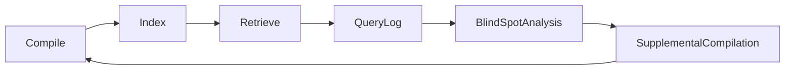
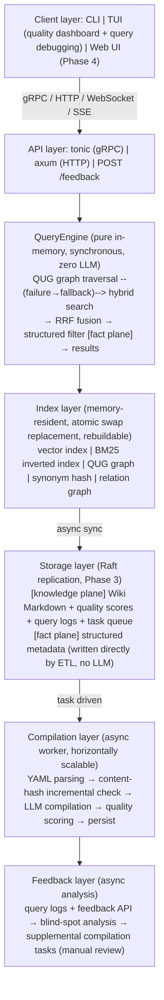

# Wiktor Master Plan Summary (v3 Final)

> Merged version of v2 (the DSL-removal version) + review revisions + branding decisions.
> The substantive changes in v3 relative to v2 are listed in the "Change Log" at the end.
>
> **v3.2 synchronization note (2026-09-20)**: The architecture fork has been finalized (final form = database); the storage core has been switched to all-in-one SQLite (WAL/FTS5/sqlite-vec/litestream, dropping redb + a hand-written openraft log storage); full-text search uses FTS5; serde_yaml → serde_yaml_ng; the consensus revisions of the three-member blind review panel have also been merged (recompilation brake, filter pushdown, reliability contract, MVP definition, etc.). **The design is governed by `MASTER-PLAN.md` (v3.2)**; the phase breakdown and acceptance criteria in this document remain in effect, but mentions such as redb / openraft / self-built inverted index / tantivy timeline should be read per the settled matters in v3.1.

## 1. Project Overview

**Project name**: Wiktor (wiki + vector, pronounced "Victor")
**Positioning**: knowledge compilation and retrieval middleware
**In one sentence**: provides API, clustering, and high-availability capabilities like a database; uses an LLM to compile raw data into a structured Wiki at ingestion, and uses hybrid search for semantic recall at query time.

**Core narrative**:
- Generic middleware base + pluggable domain packs
- The core layer only knows entities, types, fields, relations; products, documents, and code are all domain packs
- Products are the first official domain pack (Reference Implementation)
- Reads and writes are fully separated: writes are slow (LLM compilation, async), queries are fast (in-memory index, zero LLM)

**Benchmark targets**: etcd's reliability + Redis's query experience + Meilisearch's retrieval quality

## 2. Problems and Motivation

**Pain points of existing solutions**:
- Traditional RAG re-retrieves and re-reasons for every query; knowledge cannot accumulate
- LLM Wiki compilation quality is unstable; there is no quality evaluation or iteration mechanism
- Query rewriting depends on static synonym tables and cannot handle complex intents
- Compilation and retrieval form a one-way pipeline; knowledge blind spots discovered at retrieval time cannot be fed back
- No middleware-level open-source project integrates "compilation + retrieval" into a system that is clusterable, pluggable, and domain-extensible

**Wiktor's solution**: upgrade knowledge compilation from a one-off LLM call into an **observable, iterable, feedback-enabled engineering system**.

## 3. Core Design Principles

1. **Two-plane data model** (new in v3, highest priority):
   - **Knowledge plane (Wiki)**: definitions, synonyms, category hierarchy, ingredient relations, intent templates — slow-changing, LLM-compiled, pure Markdown, human-readable. These are the Wiki pages.
   - **Fact plane (metadata store)**: filterable fields such as price, stock, and sugar level — fast-changing, written directly by ordinary ETL, never flowing through the LLM.
   - **Iron rule: high-frequency fluctuating SKU fields never enter Wiki pages**; otherwise every price change = one LLM recompilation, and the cost is absurd.
2. **The Wiki is the source of truth for knowledge; vectors are a derived index**. Markdown can be version-controlled and migrated; once the vector index is deleted, it can be fully rebuilt from the Markdown.
3. **The query path has zero LLM and zero async external calls**. QUG graph traversal + in-memory index + rayon parallelism, pure CPU.
4. **QUG must have a fallback**: queries that QUG cannot handle fall back to plain hybrid search; this is a first-class query path, not a logging byproduct.
5. **Domain assumptions do not enter the core layer**. Category hierarchy, attribute key-values, and synonym mappings all sink into the domain pack.
6. **Plugins depend only on core, not on server**. Vector stores and data source adapters are implementers of core traits.
7. **Single-binary distribution**. CLI + TUI + server are packaged together, ready to use after download.
8. **Domain packs use YAML + Prompt templates + page templates**, without introducing a custom DSL.

## 4. Three Core Innovations

### Innovation 1: Compilation quality observability (v3 split the cost model)

The five dimensions are implemented in two categories:

| Dimension | Nature | Phase | Evaluation method | Threshold trigger |
|------|------|------|---------|---------|
| Coverage | **Computable by rules** | 1 | Ratio of source-data fields referenced by the Wiki (relies on the Prompt output contract forcing source references) | < 60% recompile |
| Citation integrity | **Computable by rules** | 1 | Whether every assertion is backed by a source field; mechanical comparison | No reference → mark for verification |
| Schema compliance | **Computable by rules** | 1 | Whether it conforms to the domain pack Schema; serde validation | Non-compliant → reject from store |
| Information density | **Approximate rule** | 1 | Effective-information tokens / total tokens | < 40% compress-and-recompile |
| Consistency | **Requires LLM** | 2 | Contradiction detection against existing pages; O(N) cost, must approximate with "embedding recall of top-k related pages + LLM arbitration"; full comparison forbidden | Contradiction → manual review queue |

**Key mechanism**: The Prompt output contract requires every assertion to carry a source field reference — this single clause turns four of the dimensions from "LLM evaluation" into "mechanical verification", so that the quality scorer can land in a week rather than a month.

**Quality dashboard**: shows quality trends by category, by time, and by model. Low-quality pages automatically enter the recompilation queue, forming a "compile → score → recompile" loop.

### Innovation 2: Query Understanding Graph (QUG)

Five types of semantic edges, built at compile time, traversed read-only at query time, millisecond-level:

| Edge type | Example | Behavior at query time |
|--------|------|-----------|
| Synonym edge | boba ↔ pearl/boba | Direct substitution |
| Hyponym edge | milk green tea → milk tea → beverage | Category-expanded recall |
| Attribute propagation edge | "not sweet" → sugar level ≤ 30% | Converted to a structured filter (**lands in the fact plane**) |
| Intent template edge | "good for drinking in winter" → hot drink + high calorie | Expanded into a composite query |
| Negation edge | "no pearls" → exclude ingredients containing pearls | Generates an exclusion filter |

**v3 additions**:
- **Two-track source for intent template edges**: high-frequency templates are hand-written into YAML by the domain pack author (the template is the domain knowledge); LLM extraction only handles long-tail increments.
- **Explicit fallback**: QUG has no matching path → go straight to hybrid search, and mark `rewrite_failure` in the query log for the feedback layer to analyze.

### Innovation 3: Compilation-retrieval two-way feedback



Three blind-spot signals: zero-recall queries / low-quality recall (low click-and-acceptance rate) / query rewrite failures.

**v3 additions**:
- **Relevance Feedback API** (`POST /feedback`) is a Phase 2 deliverable — the middleware has no UI, so acceptance signals must be sent back by the upper-layer application.
- Feedback tasks enter the manual review queue and are not executed automatically, preventing noise pollution.

## 5. Architecture Overview (v3 revision: explicit two planes + fallback)



## 6. Domain Pack Configuration

```yaml
# domains/ecommerce/domain.yaml
name: ecommerce
version: 1.0

entities:
  - name: product
    source: jsonl://examples/milk-tea/products.jsonl   # Phase 1 JSONL; add postgres:// in Phase 2
    id_field: sku_id
    type_field: category_path
    fields:
      - name: price
        type: numeric
        filterable: true      # filterable/numeric → fact plane, never enters the Wiki
      - name: ingredients
        type: list<alias>
        alias_source: ingredient_aliases   # semantic field → knowledge plane, enters compilation

types:
  - name: category
    parent_field: parent_category
    compile: true
    template: templates/category_page.md
  - name: brand
    compile: true

relations:
  - name: belongs_to
    from: product
    to: category
    extract: source_field
  - name: pairs_with
    from: ingredient
    to: ingredient
    extract: llm

qug:
  intent_templates: templates/intents.yaml   # hand-written high-frequency intent templates
  extract_edges: llm                          # LLM extracts long-tail edges

compile:
  prompt: prompts/product_compile.md
  output_contract: require_source_refs        # assertions must carry source references
  quality_threshold: 0.75
  on_low_quality: recompile
  incremental: content_hash                   # restored in v3: content-hash incremental compilation

query:
  rewrite: qug
  fallback: hybrid_search                     # explicit fallback in v3
  filters: [price, category, ingredients]
  rerank: cross_encoder                       # Phase 2
```

## 7. Core Abstractions (Rust traits)

```rust
// data source adapter
trait DataSource {
    async fn fetch(&self, cursor: Option<Cursor>) -> Result<Vec<RawEntity>>;
    fn schema(&self) -> EntitySchema;
}

// fact-plane storage (new in v3)
trait EntityStore {
    async fn upsert_facts(&self, id: &EntityId, facts: &Facts) -> Result<()>;
    async fn filter(&self, filters: &Filters) -> Result<Vec<EntityId>>;
}

// compiler (with quality scoring)
trait Compiler {
    async fn compile(&self, raw: RawEntity, ctx: &CompileContext) -> Result<CompiledPage>;
}

struct CompiledPage {
    wiki: WikiPage,
    quality: QualityScore,
    qug_edges: Vec<QugEdge>,
    content_hash: u64,   // basis for incremental compilation
}

struct QualityScore {
    coverage: f32,          // rule
    citation: f32,          // rule
    schema_compliance: f32, // rule
    density: f32,           // rule
    consistency: Option<f32>, // LLM，Phase 2
}

// query understanding graph
trait QueryUnderstandingGraph {
    /// None means QUG cannot handle it; the caller must fall back to hybrid search
    fn rewrite(&self, query: &Query) -> Option<RewrittenQuery>;
    fn traverse(&self, node: &str, depth: usize) -> Vec<QugPath>;
}

enum QugEdge {
    Synonym { from: String, to: Vec<String> },
    Hyponym { from: String, to: String },
    AttributePropagation { phrase: String, filter: Filter },  // lands in the fact plane
    IntentTemplate { phrase: String, expansion: Query },
    Negation { phrase: String, exclusion: Filter },
}

// domain pack
trait DomainPack {
    fn name(&self) -> &str;
    fn config(&self) -> &DomainConfig;
    fn compiler(&self) -> Box<dyn Compiler>;
    fn qug_builder(&self) -> Box<dyn QugBuilder>;
    fn reranker(&self) -> Option<Box<dyn Reranker>>;
}

// feedback analyzer
trait FeedbackAnalyzer {
    async fn analyze(&self, logs: &[QueryLog]) -> FeedbackReport;
}

struct FeedbackReport {
    zero_recall_queries: Vec<Query>,
    low_quality_hits: Vec<PageId>,
    rewrite_failures: Vec<Query>,
    suggested_compilations: Vec<CompileTask>,  // enters the manual review queue
}

// vector-store adapter
trait VectorStore {
    async fn upsert(&self, collection: &str, ids: &[String], vectors: &[Vec<f32>], metadata: &[Metadata]) -> Result<()>;
    async fn search(&self, collection: &str, query: &[f32], top_k: usize, filters: Option<&Filters>) -> Result<Vec<SearchHit>>;
    async fn delete(&self, collection: &str, ids: &[String]) -> Result<()>;
}
```

## 8. Repository Structure

```
wiktor/                          # single-repository Cargo workspace
├── Cargo.toml
├── crates/
│   ├── wiktor-core/             # core engine (traits + QueryEngine + QUG + two-plane model)
│   ├── wiktor-quality/          # quality scorer (Phase 1: 4 rule dimensions)
│   ├── wiktor-feedback/         # feedback analyzer（Phase 2）
│   ├── wiktor-server/           # server gRPC + HTTP (Phase 2)
│   ├── wiktor-cli/              # CLI + TUI (same binary)
│   ├── wiktor-vector-bruteforce/ # Phase 1: brute-force scan (500 products are sufficient)
│   ├── wiktor-vector-hnsw/      # Phase 2
│   ├── wiktor-vector-qdrant/    # Phase 4
│   ├── wiktor-vector-lancedb/   # Phase 4
│   ├── wiktor-vector-pgvector/  # Phase 2 first real plugin
│   └── wiktor-adapter-jsonl/    # Phase 1 data source (postgres adapter in Phase 2)
├── domains/
│   └── ecommerce/               # official ecommerce domain pack
│       ├── domain.yaml
│       ├── prompts/
│       └── templates/
├── docs/
│   ├── PLAN.md                  # this document
│   ├── brand/                   # brand assets (see docs/brand/)
│   ├── domain-pack.md
│   ├── quality-metrics.md
│   └── qug-design.md
└── examples/
    └── milk-tea/
        ├── products.jsonl       # 100-500 products
        ├── golden-queries.jsonl # evaluation set: query → expected hit product list (first-class deliverable)
        └── seed-wiki/           # 20 hand-compiled seed Wiki pages
```

## 9. Technology Stack (v3 revision)

| Layer | Choice | Notes |
|------|------|------|
| Language | Rust | Core, server, CLI/TUI |
| Async runtime | tokio | |
| gRPC / HTTP | tonic / axum | Phase 2 |
| Raft | openraft | Phase 3; redb has no ready-made log storage, needs a hand-written one, reserve several months |
| Embedded storage | **redb** (sled removed; its maintenance has stalled) | Standalone storage engine |
| Vector index | Phase 1 brute-force scan → Phase 2 hnsw_rs or arroy | 500 products don't need HNSW |
| Full-text search | Phase 1 simple in-memory inverted index → Phase 2 tantivy | Same as above |
| Graph structure | petgraph | QUG |
| Config parsing | serde_yaml | Domain packs |
| Concurrent hash | dashmap | Synonym mappings |
| Cache | moka | Query result cache |
| TUI | ratatui + crossterm | Dashboard |
| Web UI | Tauri + React | Phase 4 |
| LLM calls | rig or async-openai | Compilation layer, isolated behind traits and replaceable |
| Embedding model | fastembed-rs | Local BGE; embedding granularity: page summary + section-level dual index (Phase 2) |
| Serialization | serde + prost | |
| Observability | tracing + prometheus | |

## 10. Roadmap (v3 reordered Phase 1)

### Phase 1: Standalone validation (1-2 months, three steps)

**Step 1 (Week 1): hand-compiled validation of the data model — no LLM yet**
- `wiktor-core` trait definitions + the two-plane data model
- Hand-write 20 milk-tea seed Wiki pages (`examples/milk-tea/seed-wiki/`)
- JSONL fact plane + brute-force vector search + simple inverted index
- **Goal: keep data-model issues from being held hostage by prompt debugging**

**Step 2 (Weeks 2-4): LLM compilation pipeline + quality scoring**
- `wiktor-quality` four rule dimensions (coverage / citation / schema / density)
- Prompt output contract (require_source_refs)
- Content-hash incremental compilation
- `wiktor-cli`: `compile`, `search`, `status` (JSON output, TUI deferred)

**Step 3 (Weeks 5-8): QUG + evaluation**
- Build the five QUG edge types (hand-written templates + LLM extraction) + explicit fallback
- golden-queries.jsonl evaluation set
- `wiktor tui` quality dashboard (if time permits)

**Validation metrics**:
- Quality scoring vs. human evaluation correlation > 0.7
- Milk-tea scenario recall: pure vector vs. hybrid vs. QUG-enhanced (based on golden queries)
- Whether a YAML domain pack can express all the rules of the milk-tea domain

### Phase 2: Middleware (2-3 months)
- `wiktor-server`: gRPC + HTTP + **POST /feedback**
- Hybrid search (BM25 + vector + RRF); tantivy + hnsw_rs/arroy
- QUG consistency dimension (embedding recall of top-k + LLM arbitration)
- `wiktor-feedback` + postgres data source adapter + pgvector plugin
- Prometheus metrics + structured logs + domain pack registration mechanism

**Validation metrics**: QUG vs. static mapping accuracy; recall improvement after 3 feedback-loop iterations; query P99 < 50ms; plugin integration cost < half a day

### Phase 3: High availability (3-6 months)
- openraft storage-layer replication (hand-written redb log storage) + async index-layer sync
- CLI `cluster` command group; primary failover < 10s

### Phase 4: Clustering and ecosystem (6 months+)
- Namespace sharding + routing; Qdrant/LanceDB/Milvus plugins; Web UI (Tauri)
- Second official domain pack (technical documentation) + domain pack contribution guide

## 11. Performance Targets

| Query type | Target P99 | Path |
|---------|---------|------|
| Cache hit | < 5ms | moka |
| Pure structured filter | < 10ms | Fact-plane in-memory index |
| Pure vector search | < 20ms | Phase 2 HNSW (relaxed to brute-force in Phase 1) |
| Hybrid search + RRF | < 50ms | vector + BM25 + fusion |
| With QUG rewrite | < 60ms | graph traversal + hybrid search |
| QUG fallback | same as hybrid search | no penalty |
| Write path | minute-level | async tasks |

## 12. Key Design Decisions

1. **Two-plane data model**: knowledge goes into the Wiki (LLM-compiled), facts go into metadata (written directly by ETL). filterable/numeric fields never enter the Wiki.
2. **The query path has zero LLM and zero async external calls**, and QUG has an explicit fallback.
3. **Quality scoring: four rule dimensions + one LLM dimension**; the Prompt output contract (require_source_refs) is the prerequisite for the four rule dimensions.
4. **QUG is built at compile time and read-only at query time**; intent templates are hand-written + LLM long-tail, a dual track.
5. **Incremental compilation relies on the content hash**, and index replacement is an atomic swap.
6. **The feedback loop is async + manual review**, and the relevance feedback API is a Phase 2 deliverable.
7. **Phase 1 does hand compilation before connecting the LLM**; the evaluation set (golden queries) is a first-class deliverable alongside the dataset.
8. **Domain packs are YAML + Prompt + templates, no DSL**.
9. **Early phase: single-repo Cargo workspace**; vector plugins and UI keep portable dependencies.

## 13. Risks and Mitigations

| Risk | Mitigation |
|------|------|
| Large gap between quality scoring and human evaluation | Key validation focus in Phase 1; the scoring model is replaceable |
| High QUG graph construction cost | Incremental construction + content hash |
| Insufficient YAML expressiveness | Validated by hand compilation in Step 1; limited extension if necessary |
| Feedback-loop noise | Manual review queue, no automatic execution |
| Scale ceiling (Wiki volume explosion) | Category tiering: deep compilation for core, lightweight indexing for long tail |
| Weak Rust LLM ecosystem | Trait isolation; switch to async-openai if rig is insufficient |
| Engineering complexity out of control | Strict phasing; Phase 1 does not do Raft/cluster/Web UI/consistency dimension |
| openraft + redb integration difficulty | Reserve several months; if it fails, degrade to primary-replica replication |
| Hard open-source cold start | Make the milk-tea domain pack "textbook-grade" |

## 14. Brand

- **Mascot**: spider. Action-level fit: web-building = compilation, vibration sensing = zero-LLM retrieval, re-weavable web = rebuildable vector index. Forced mappings were dropped (8 legs = protocols, 8 eyes = quality dimensions).
- **Primary logo**: **pure geometric web + centered W** (no spider drawn) — avoids two prior occupancies: Tarantool (database, spider brand) and Scrapy (crawler framework, where spider means scraping), while also preventing "spider + search" from being misread as a crawler tool.
- **Spider as secondary character**: documentation illustrations, release notes, TUI easter egg `wiktor spider`; the `#` on its abdomen echoes Markdown.
- **Palette**: deep navy `#101A2E` / warm orange `#E8833A` (silk) / off-white `#F5F0E8` (nodes and W) / beige `#FAF7F2` (light background).
- **TUI splash ASCII** (spokes + double spiral rings + W):

```
      \  |  /
    .-.\\|//.-.
   (   \\|//   )
  --(--  W  --)--
   (   //|\\   )
    '-'//|\\'-'
      /  |  \

     w i k t o r
```

- Assets: `docs/brand/` (ascii-logo.md, gen_logo.py, wiktor-web[-dark|-light].svg, wiktor-spider-dark.svg)
- **Name-check results** (2026-09-19): crates.io `wiktor` ✅ available; GitHub `wiktor` ❌ occupied by a 2008 legacy account, `wiktor-rs` / `wiktor-db` ✅ available. Suggested: crate name `wiktor` + org name `wiktor-rs` (the two need not match). Confirm availability of domains wiktor.dev / wiktor.io before registering.

## 15. Next Actions

1. Register crates.io `wiktor` + GitHub org `wiktor-rs` (can stake the names first)
2. `wiktor-core` trait definitions (including the two-plane model, QUG returning Option, QualityScore with four + one fields)
3. Finalize the domain pack YAML, validate expressiveness with the milk-tea domain
4. Cargo workspace + CI skeleton
5. Milk-tea examples: products.jsonl + golden-queries.jsonl + 20 hand-written seed Wiki pages
6. Run through the minimum closed loop: hand-written Wiki → index → QUG/fallback query → CLI display
7. Connect the LLM compilation pipeline + four-rule-dimension quality scoring
8. Evaluation: recall-rate comparison report of pure vector vs. hybrid vs. QUG

## Change Log

**v3.1 (2026-09-20)**: The three-member blind review panel's unanimous conclusion was "needs revision before merge"; the consensus items have been merged into `MASTER-PLAN.md` v3.1: ①architecture fork finalized — the final form is a full-stack middleware (database), with "minimal core first" as the delivery path, and external engines (Meilisearch) downgraded to optional plugins; ②storage stack switched to all-in-one SQLite (WAL/FTS5/sqlite-vec/litestream), dropping the default redb+openraft route; ③full-text search uses FTS5 (tantivy becomes a scale-up evolution option); ④serde_yaml → serde_yaml_ng; ⑤recompilation brake (per-page cap of 2 + token-budget circuit breaker); ⑥filter pushdown revision (the original "post-RRF filtering" missed recall); ⑦new reliability contract (all-dependency BLAKE3 hashing, task state machine, source_revision CAS, quarantine publish state machine, cache invalidation, prompt injection protection); ⑧evaluation deliverables completed (golden-queries ≥ 100 entries + 50-100 pages of manually annotated set) + QUG exit condition (default off when gain < 5%); ⑨benchmark narrative revision (experience benchmarked against Meilisearch, reliability against etcd); ⑩MVP definition (TUI/SSE/Raft/external plugins not in the minimum complete form). The phase breakdown and acceptance criteria in this document remain in effect; technical-selection statements should be read per the above.

**v3 (2026-09-19) relative to v2**:
1. Added the **two-plane data model** (principle #1, architecture diagram, EntityStore trait) — answers the question v2 left open ("where do products live in the Wiki? are vectors just an index?"): knowledge goes into the Wiki, facts go into metadata, and the vector index covers both planes.
2. **Quality scoring split**: four rule dimensions (Phase 1, relies on the require_source_refs contract) + an LLM consistency dimension (Phase 2, top-k arbitration, full comparison forbidden).
3. **QUG explicit fallback** (`rewrite` returns Option) + intent-template hand-written/extraction dual track + golden-queries evaluation set promoted to a first-class deliverable.
4. **Technology stack revision**: removed sled, use redb; Phase 1 drops HNSW/tantivy (brute-force scan + simple inverted index); data source starts with JSONL.
5. **Phase 1 reorder**: hand-compile 20 pages to validate the data model before connecting the LLM; TUI deferred; content-hash incrementality, atomic swap, and the relevance feedback API restored.
6. **Brand finalized**: web primary logo + spider mascot (including the Tarantool/Scrapy occupancy facts and the avoidance strategy), palette and ASCII finalized.